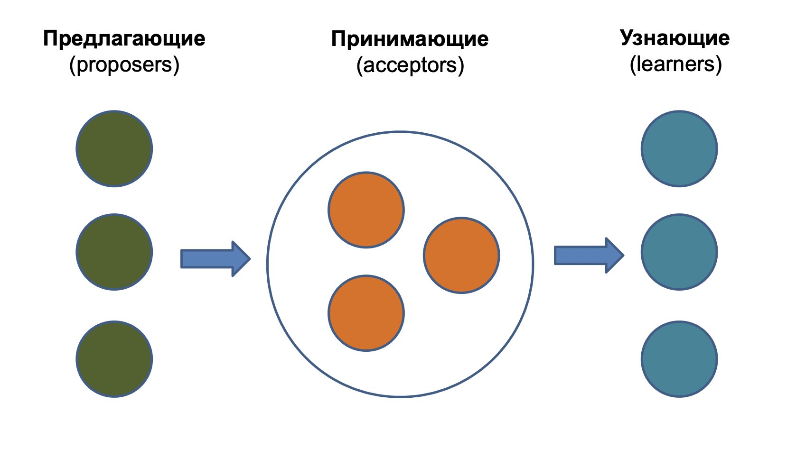
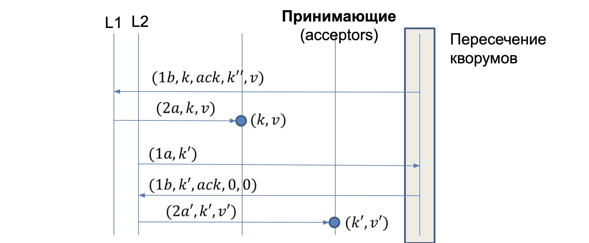

# Консенсус в асинхронной сети

Мы уже научились делать консенсус в синхронной сети, давайте теперь вместо асинхронности (в условиях FLP) откажемся от чего-то другого.

Можно прийти к консенсусу:

- Если нет отказов (легко)
- Если сделать сеть синхронной (ограничить время доставки сообщений)
- Если сделать алгоритм недетерминированным (случайным)
- Если ослабить требования при которых в алгоритме обязан быть прогресс (то есть он обязан завершаться)

## Недетерминированные алгоритмы

- Разрешаем процессам кидать монетку
- Требуем достижения консенсуса с вероятностью 1
- Порядок исполнения операций в системе выбирает противник
  - Сильный противник знает все состояние системы
  - Слабый противник как-то ограничен (более реалистично)

По FLP мы сможем прийти к консенсусу несмотря на асинхронность.

- Алгоритм Бен-Ора (1983) для бинарного консенсуса работает даже при сильном противнике при любом $f < N/2$, где $f$ - количество отказавших узлов
- Но ожидаемое время достижения консенсуса $O(2^N)$.

### Алгоритм Бен-Ора

Множество раундов, по две фазы в раунде. На каждой фазе каждый процесс ждет $N - f$ сообщений.

Фаза 1, Предпочтение:

- Процесс рассылает текущее предпочтение, посылая всем сообщение $(1, k, p)$, где $k$ - это номер раунда
- Если больше $N/2$ голосов за одно значение, то ратифицирует

Фаза 2, Ратификация:

- Процесс шлет сообщение $(2, k, v)$, чтобы ратифицировать значение или $(2, k, ?)$, если не набрал нужное число голосов
- Получив хотя бы одну ратификацию (свою или от другого) на следующий раунд меняет предпочтение на полученное $v$
- Получив больше $f$ ратификаций процесс **принимает решение $v$ (decide)**, но продолжает исполняться
- Не получив ратификации, меняет предпочтение для следующего раунда на **случайное**

### Корректность алгоритма Бен-Ора

Лемма 1: В одном раунде разные процессы не могут ратифицировать разные значения

- Очевидно из необходимости набрать больше $N/2$ сообщений $(1,k,v)$ для ратификации значения $v$

Лемма 2: Если в раунде $k$ процесс принял решение $v$, то $k+1$ раунд все процессы начнут с предпочтением $v$

- Чтобы принять решение, процесс получил минимум $f+1$ сообщений вида $(2,k,v)$. Сообщений с другим $v$ не может быть по лемме 1.
- Чтобы начать раунд с другой предпочтением, процесс должен был получить $N - f$ сообщений вида $(2,k,?)$.
- Но $(f + 1) + (N - f) > N$ - противоречие.

### Заключение

Чтобы остановить алгоритм, нужно высылать сообщение **decide** как только решение принято (раньше говорили, что алгоритм не останавливается?????), и при его получении принимать решение и останавливаться.

Система асинхронная! Сообщения не обязаны приходить в каждый процесс "раунд за раундом". Но так как на каждом раунде мы ждем $N - f$ сообщений, то фактически раунды получаются почти синхронными.

## Специальные алгоритмы

### Replicated State Machine

Имеем некое состояние (значение счета в банке, состояние персонажа в игре). Его надо быстро обновлять (то есть, не можем позволить себе держать его на диске) и защищать от сбоев узла, где оно хранится

Решение:

- Держим несколько копий этого состояния на разных узлах для надежности

Если операции детерминировано влияют на состояние, то можем независимо примять все операции к разным репликам, то встает проблема поддержания одинакового состояния (если события не коммутируют между собой).

То есть, при одновременной попытке выполнить несколько операций нужно прийти к консенсусу какая операция будет первой.

## Paxos

Лампорт, 1989. Первый алгоритм практического асинхронного консенсуса.

- Каждый процесс выбирает одно значение из множества предложенных (более сильное требование, чем нетривиальность)
- Гарантирует согласие при любых отказах и произвольных задержках сообщений
- Но не гарантирует завершение за конечное время (но на практике, когда отказы происходят не часто, консенсус достигается за конечное число шагов)

Для начала решим задачу однократного консенсуса, например, задачу выборa i-ой операции над RSM.

Имеем множество предлагающих (**proposer**) процессов:

- Это процессы, пытающиеся выполнить операция над RSM и предлагающие свою операцию в качестве следующей

Проще всего, когда принимает решение один принимающий (**acceptor**) процесс:

- Тогда нет проблемы прийти к консенсусу (принимается первое сообщение, пришедшее к принимающему)
- Но в случае отказа принимающего процесса в системе не будет прогресса, поэтому нужно несколько принимающих решение процессов

Нужна возможность узнать о принятом решение некому множеству узнающих (**learner**) процессов:

- Принимающие процессы не обязаны быть теми же самыми, которые хранят копию состояния RSM. Они могут лишь принимать решение о порядке операций, сообщая о нем множеству узнающих процессов, которые обновляют у себя состояние RSM

### Кворум принимающих

Кворумы определяются как подмножества множества принимающих процессов таким образом, чтобы любые два подмножества (то есть любые два кворума) имели по крайней мере один **общий элемент**.

Принимающие процессы и используемый кворум заранее выбраны и зафиксированы.

Пример кворума: простое большинство (2 из 3-х - это кворум).

Для кворума не нужны все процессы, поэтому отказ одного или нескольких процессов (в зависимости от используемого кворума) не остановит работу.

Предполагается что отказ временный и через некоторое время отказавший принимающий процесс продолжит работу:

- Отказ это когда процесс "уснул надолго и не отвечает"
- Переконфигурирование алгоритма это отдельная задача

### Лидер принимающих

Лидер выполняет вспомогательную функцию в алгоритме.

Каждый предлагающий должен знать множество принимающих (фиксированное) и кто из них лидер. Причем лидер должен меняться, если старый лидер отказал.

- Мы не можем гарантировать выбор одного лидера за конечное время (для этого надо прийти к консенсусу)
- Но будем пытаться тривиально выбирать лидера за конечное время
- В какой-то момент может временно оказаться несколько лидеров
  - Разные принимающие будут иметь свое мнение о лидере
  - Но алгоритм Paxos будет гарантировать согласие и в этом случае, но без гарантий завершения, пока лидеров несколько

### Основа алгоритма Paxos

Для прихода к консенсусу Paxos делает один или несколько раундов голосования:

- Раунд голосования инициируется лидером (предложения высылаются ему, а он их ставит на голосование)
- Несколько раундов может случиться только если нет согласия о едином лидере или если что-то отказало, и надо его начать заново
- Если лидер не один, то несколько голосований может происходить одновременно
- Каждое запущенное голосование имеет уникальный номер $k$
  - Как обычно, можно взять пару из номера процесса и локально-увеличиваемого счетчика
- Лидер может заново инициировать голосование по своему усмотрению, если видит что прогресса нет, с другим номером $k$

Примерная схема: на 1-ой фазе лидер добивается от кворума принимающих обещание, что они за него, а на 2-ой фазе выбирает какое-то предложение и рассылает его своим принимающим.

У принимающего есть две независимых компоненты состояния: кому он что-нибудь пообещал (только лидер и номер голосования) и какое предложение он принял (от какого лидера, номер голосования, какое значение).

### 1-я фаза голосования

Фаза 1а, Подготовка:

- Лидер инициирует голосование и посылает сообщение $(1a, k)$ кворуму принимающих, где $k$ - глобально уникальный номер голосования

Фаза 1b, Обещание:

- Получив сообщение $(1a, k)$ принимающий обещает не принимать предложение с меньшим номером и отвечает:
  - $(1b, k, ack, k', v')$, где $(k', v')$ - это информация о принятом предложении с максимальным номером $k' < k$ (см. фазу 2b), где $k'=0$ если ничего еще не принято
  - Или сообщает, что уже дал другое обещание для $k'' > k$ и отвечает $(1b, k'', nack)$, на что лидер повторит 1a заново, послав $(1a, k'' + 1)$

### 2-я фаза голосования

Фаза 2a, Запрос:

- Лидер, получив обещания $(1b,k,ack,k',v')$ от кворума принимающих, предлагает значение
  - Берет значение $v'$ для наибольшего $k'$, полученного от принимающих
  - А если все $k'=0$, то предлагает свое значение $v$ и посылает $(2a,k,v)$ кворуму принимающих
  - На 2-ой фазе можно использовать другой кворум

Фаза 2b, Подтверждение:

- Если принимающий получает запрос $(2a,k,v)$, и он не давал обещание для $k' > k$, то он принимает предложение $(k, v)$ и посылает сообщение $(2b,k,v)$ всем узнающим
- Узнающий, получив сообщение $(2b,k,v)$ от кворума принимающих, узнает о том, что выбрано значение $v$

### Обработка отказов

- Если лидеру не удалось собрать консенсус за какое-то время, он может попробовать ещё раз
- Если какой-то узел давно ничего не слышал от лидера, он может инициировать перевыборы
- Если лидер увидел второго лидера, можно выбрать, кому жить (например, тому, у кого номер голосования меньше)

### Корректность

Если есть два принятых предложения $(k, v)$ и $(k', v')$, то $v = v'$.

Доказательство от противного:

Предположим, приняты $(k, v)$ и $(k', v')$, но $v \ne v'$

- Без потери общности $k' > k$, и $k'$ такой наименьший

Если у нас получились решения $(k,v)$ от одного кворума принимающих и $(k',v')$ от другого кворума принимающих, то эти кворумы пересекаются по принимающему $P$.

Тогда получаем, что $P$ сначала в голосовании $k$ принял от лидера предложение $v$, а потом в голосовании $k'>k$ принял от второго лидера предложение $v'$ (поскольку $(k, v)$ еще не закоммитилось?), при этом пообещав не подтверждать предложения $< k'$.

Когда настал черед подтверждать предложение, $L2$ отправил $P$ предложение $(k', v')$, и тот передал его узнающим.

А что с $(k, v)$? Черт знает, надо пересмотреть доказательство с лекции!!!!

### Пример бесконечной работы алгоритма Paxos

Пусть объявилось два лидера:

- Первый шлет предложение принимающим и собирает кворум на обещание
- Второй делает то же самое, перетянув обещания с первого на себя
- Первый не собирает кворум на подтверждение и снова выполняет первый шаг

Избежать такого длительного зацикливания можно, например, с помощью рандомизированных таймаутов.

## Multi-Paxos

Выполняя Paxos много раз подряд, можно делать 1-ю фазу один раз для всех копий сразу (потому что она не зависит от $v$), и, подтвердив факт начилия уникального лидера таким образом, сделать для каждой копии алгоритма Paxos свою 2-ю фазу. Получаем задержку в 3 сообщения между консенсусами вместо задержки в 4 сообщения.

Надо пересмотреть лекцию и дополнить инфой!!!!
