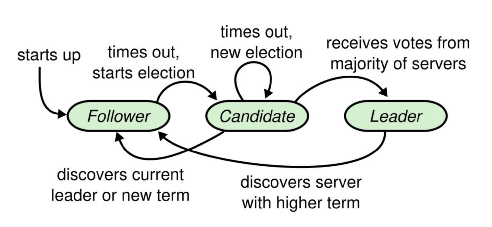
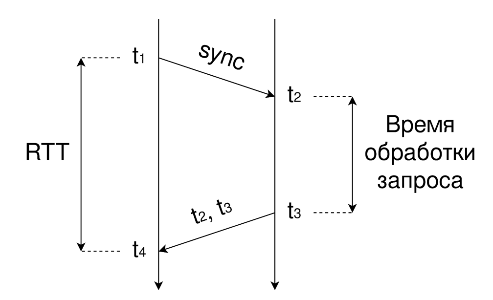

# Raft

## Replicated State Machines (продолжение)

Наблюдения:

- Структура данных детерминировано восстанавливается из журнала операций
- Давайте добиваться идентичности журналов на разных узлах
- Тогда структуры данных тоже будут идентичны
- Значит, решаем задачу репликации журнала

Давайте заниматься репликацией журнала с помощью Raft.

## Структура алгоритма Raft

- Лидер принимает команды от пользователей
- Осуществляет репликацию журнала
- Остальные сервера принимают записи от лидера
- В случае сбоя лидера узлы выбирают нового

### Сроки избрания (термы) и лидеры

Исполнение алгоритма делится на сроки. Сроки нумеруются возрастающими целыми числами. Вначале каждого срока выбираем одного лидера, потом реплицируем журнал.

Иногда выбрать лидера не удаётся и такой срок считается неуспешным, нужны перевыборы.

### Выборы

Чтобы стать лидером, запрашиваем у всех серверов голос за себя, и, получив голоса у кворума, становимся лидером (о том, что мы собрали кворум, знаем только мы).

В сроке избрания $t$ процесс может отдать голос только первому процессу, который у него его попросил (а голос за себя у него есть автоматически). На все последующие запросы нужно отвечать "нет" или игнорировать.

В случае, если никто не объявил себя лидером, срок считается неуспешным.

### Election timeout

Когда процесс не получает сообщений от лидера уже какое-то время, он считает лидера отказавшим и выдвигается в кандидаты.

Заметим, что будет хорошо, если кандидаты не будут выдвигать себя в одно и то же время, поскольку иначе на трех процессах никто не сможет набрать половину голосов. Поэтому процесс становится кандидатом через случайное время (randomized election timeout).

Иллюстрация итогового графа состояний:

### Устаревшие термы

Каждый процесс знает текущий терм (текущий срок). При получении сообщения из старого терма, процесс отвечает ему ошибкой.

- Лидер, получив такой отказ, отказывается от лидерства

### Репликация журналов (в общих словах)

- Клиент присылает операцию лидеру (потом подробнее поговорим, как клиент узнает, кто лидер)
- Лидер добавляет запись в свой журнал, помечает как незакоммиченную и пересылает запись всем участникам
- Отреплицировав на кворум, помечает запись как закоммиченную
- Реплицирует журнал на отстающих участников пока они не подтвердят запись

### Коммит записей

Журнал состоит из записей. Давайте рассмотрим поподробнее репликацию и коммит записей.

- Изначально запись есть только у лидера (потому что пишут только в лидера) и помечена как незакоммиченная
- Лидер только добавляет записи в свой журнал, никогда не перезаписывает (остальные участники могут перезаписывать во время репликаций)
- Когда лидер начинает репликацию, запись на всех серверах помечена как незакоммиченная
- Когда лидер заканчивает репликацию на кворум, то применяет новую запись к локальной структуре данных
- Запись есть у кворума серверов — значит, навсегда останется на своей позиции
- Закоммиченная запись никогда не будет перезаписана
- Далее сервера применяют закоммиченную новую запись к локальной структуре данных

### Исправление журналов

Лидер может обнаружить, что у какой-то ноды суффикс журнала не совпадает с его суффиксом. Такое возможно, например, когда старый лидер не успел отреплицировать свои данные на кворум, и новый лидер попытался прислать ему свою новую пачку данных.

В таком случае, лидер должен найти первую несовпадающую запись у такой ноды и заменить суффикс на свой.

Нахождение точки расхождения может работать быстро, поскольку каждый элемент журнала состоит как минимум из полей `(term_id, in_term_id)`, которые:

- Не могут содержать пропуски по `in_term_id` в пределах одного терма
- Могут содержать пропуски по `term_id` (если лидера в какой-то момент не выбрали)

При этом префикс до точки расхождения идентичен таковому у лидера. Значит, мы можем применить бинпоиск.

Как лидер может за быстро обнаружить такое несовпадение журнала? Пусть при попытке репликации лидером на ноду, она отвечает ошибкой, если `(term_id, in_term_id)` предыдущей записи у них совпадают. Так лидер задетектит ошибку и запустит протокол исправления журнала.

Но появляется другая проблема: что если старый лидер отреплицировал данные на кворум и закоммитил их, в то время как новым лидером стала нода не из кворума? Она попытается перезатереть закоммиченные записи, что очень плохо.

### Перезаписывание закоммиченных записей

Решим проблему так: запретим голосовать за сервер, у которого журнал "меньше" нашего, потому что он знает меньше.

Меньше - это:

- Сначала сравниваем по терму последней записи
- При равенстве — по индексу внутри терма

Сервера не отдают голос за сервер с логом меньше, чем у себя, таким образом если лидер отреплицировал данные на кворум (и закоммитил), то сервер с меньшим журналом не соберет кворум за себя в голосовании.

Репликация записи из прошлого терма на большинство серверов не гарантирует, что эта запись будет закоммичена. Запись из прошлого терма считается закоммиченной только после того, как хотя бы одна запись из нашего терма была закоммичена.

?????

### Как читать из Raft как в RSM?

- Посылаем команду чтения любому серверу
- Если сервер не содержит в журнале операции именно этой команды чтения (???), он пересылает команду лидеру
- Лидер добавляет команду в журнал и реплицирует на кворум
- Сервер дожидается коммита и после отвечает клиенту

Можем хоть все сервера опросить и получить один и тот же ответ (при условии, что в это время никто не пишет?). Так работает любое чтение в модели RSM.

### Как читать из Raft без кворума?

- Посылаем команду чтения любому серверу
- Сервер отвечает, смотря только на локальную структуру данных (не используя консенсус)
- Мы можем получить устаревшие данные, но только те, что когда-то были закоммичены

То же самое касается RSM Paxos.

Есть проблема - чтение с лидера, потому что мы можем общаться с лидером, оторванным от кворума, в то время как нового лидера уже избрали.

### Raft leases

`RTT` - ??

`t` - время в течение которого сервера считают лидера лидером?

- Процесс считает себя единственным лидером в течение `t - RTT` секунд с момент получения кворума голосов
- Выбравшие его не могут участвовать в других голосованиях в течении `2 * t` секунд с момента отдачи голоса
- Требуется синхронизация физических часов

Продление престола:

`RTT_extent` - ??

- В последние секунды правления просим проголосовать за нас
- В течение `RTT_extent` проводим голосование
- Если успешно, в течение следующих `t - RTT_extent` являемся лидером

Отречение от престола:

- Если продлить не удалось, процесс перестает быть лидером
- Это произойдёт раньше, чем остальные процессы выберут нового лидера (потому что вычитаем `RTT`)
- Если согласие продлить пришло уже позже нашего отречения — игнорируем его
- Возможно, оно долго шло
- Период продления у отправившего уже истёк ???
- И он успел проголосовать

### Синхронизация часов

Так как мы потребовали синхронизации физических часов, нужно предоставить алгоритм.

- Пусть в пути запрос провёл $\sigma = (t_4 - t_1) - (t_3 - t_2)$.
- В одну сторону $\delta = \frac{(t_4 - t_1) - (t_3 - t_2)}{2}$

$$T = t_3 + delta$$

