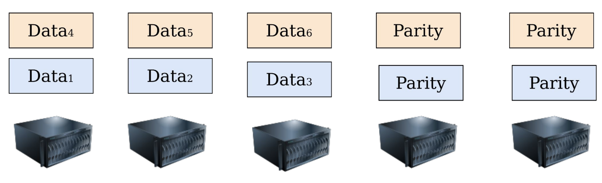
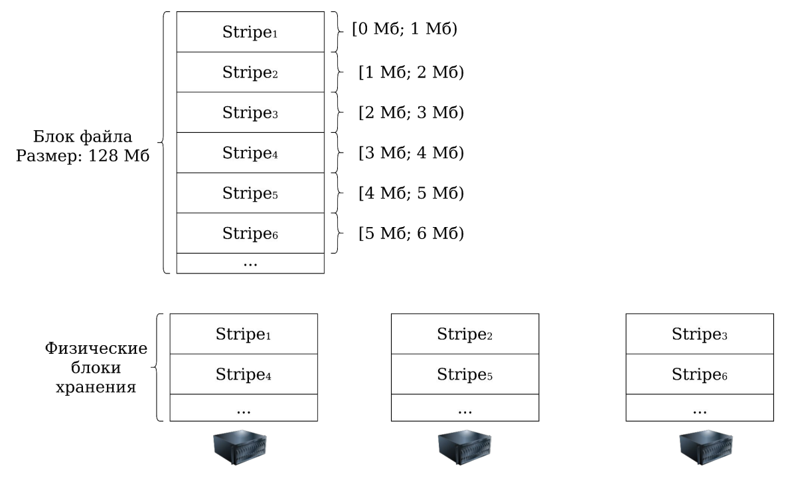
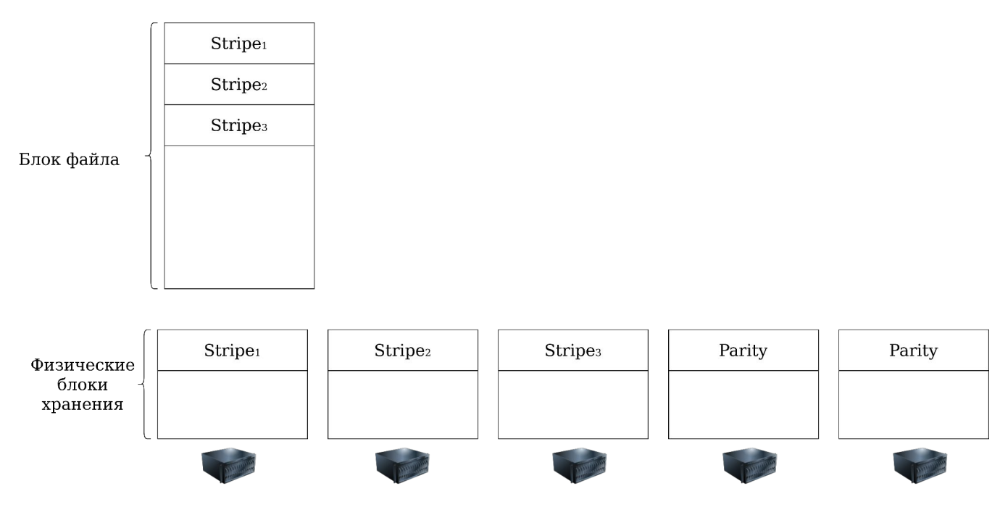
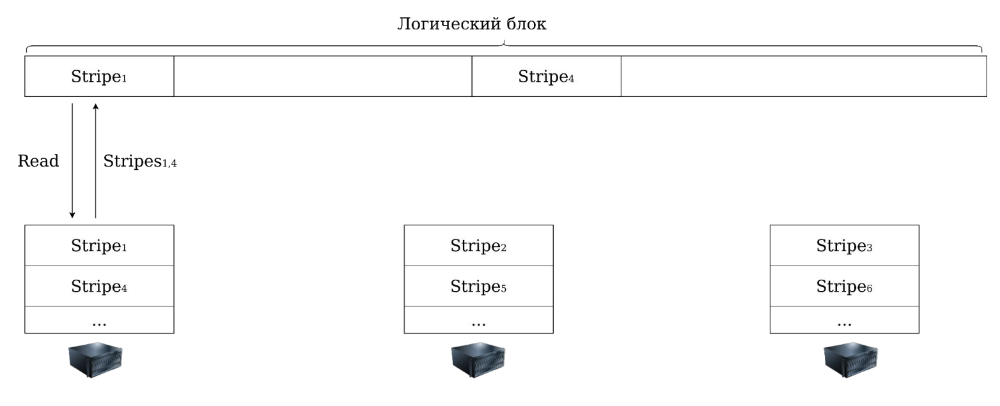

# HDFS (Hadoop Distributed File System)

## Типы узлов

NameNode:

- Хранит только метаинформацию (структура файловой системы, права доступа, дата создания, и т.д.)
- Умеет давать ссылку на место, где хранятся данные
- Существует в единственном экземпляре
- Нельзя хранить много файлов

DataNode:

- Хранит содержимое файлов
- В кластере могут быть тысячи таких узлов

## Хранение содержимого файлов

- Файл состоит из блоков
- Каждый блок хранится на нескольких DataNode (репликация)
- NameNode знает, где лежит каждый блок
- DataNode не знает, какому файлу принадлежит хранимый блок

## Стратегии размещения файлов

### Разбиение на группы

- Разбиваем DataNode на группы
- В каждой группе K серверов
- Каждая группа отвечает за свое подмножество файлов
- Сервера в каждой группе хранят идентичные блоки

Как итог, нельзя изменить фактор репликации одного файла, можно только всех сразу, и только с помощью варьирования K.

Когда в группу добавляется новый сервер, он копирует блоки с K (обычно 2-3) своих соседей. Почему-то это нетривиальная задача???

### Отсутствие групп

- Каждый узел хранит случайный набор блоков
- Каждый блок хранится на требуемом числе узлов
- Можно легко изменить фактор репликации у одного файла
- При добавлении нового сервера можно читать данные с множества DataNode (со всех, которые хранят нужные ему блоки)

## Операции с файлами

### Увеличение числа реплик

- Выбираем ещё одну DataNode, на которую поместим новую реплику
- Репликацией занимаются DataNode (данные не проходят через NameNode)

### Уменьшение числа реплик

- Даём DataNode команду удалить блок
- NameNode удаляет одну ссылку

### Обработка сбоев DataNode

- Реплицируем потерянный блок на новый узел
- Создаём ссылку на новый блок
- Удаляем ссылку на сбойный блок

### Чтение файлов

- Идём на NameNode
- Спрашиваем, где лежит блок, содержащий нужный нам байт
- Получаем набор реплик
- Читаем с любой из них
- Чтение масштабируется ????

### Спекулятивное чтение файлов

- Файлы в основном читаются последовательно
- Скорее всего, после i-ого блока клиент попросит (i+1)-ый, (i+2)-й, и так далее
- Вернём ему их адреса ещё при запросе i-ого блока

### Перезапись файла ?????

- Перезапись может пересекать границы одного блока
- Приходится разбивать её на несколько записей
- При этом первая запись может завершиться успешно, а вторая нет.

Все плохо с консистентностью.

### Изменение нескольких блоков ???

- Может произойти чередование записей
- Одновременная запись AB и CD приведет к записи AD или CB
- Поэтому HDFS не поддерживает случайную запись!

### Добавление в конец файла

- Единственная разрешённая операция изменения в HDFS
- Cоздаём новый блок на нужном числе серверов
- Записываем его на NameNode
- Оставляем ссылки на DataNode, хранящие реплики блока

## Размер блока

Нельзя делать слишком маленьким, так как будет слишком много блоков и NameNode перегрузится:

- Пусть размер блока = 1 Кб
- Храним 100 Тб данных
- Получаем сто миллиардов блоков
- И мёртвую DataNode

К тому же при последовательном чтении каждый новый килобайт нужно будет читать с нового узла, что приведет к низкой скорости последовательного доступа.

Размер блока нельзя делать и слишком большим, поскольку последовательные чтение и обработка будут заниматься продолжительное время.

Десятки / сотни Мб на размер блока - в самый раз (64, 128, 256)!

## Сборка мусора

Запись нового блока может не завершиться успешно, что потребует удаления выделенных на DataNode блоков.

DataNode периодически сообщают NameNode о хранимых блоках. NameNode командует удалять блоки, которые не являются частью ни одного файла.

## Масштабирование

Дерево со структурой ФС теоретически можно шардировать, но NameNode HDFS так не умеет. Зато для надежности NameNode умеет в репликацию.

Для подобия шардинга можно физически создать несколько NameNode с непересекающимся набором файлов (на одном - данные пользователей, на другом - логи и метрики), и эти NameNode будут делить между собой пул серверов DataNode для их автоматической балансировки.

Это называется NameNode Federation.

## Помехоустойчивое кодирование (block layout)

Репликация блоков "как есть" - очень дорогое удовольствие: при хранении 4 логических блоков получаются 8 физических мест при двукратном факторе репликации (с 3+ фактором еще хуже).

Нужно научиться:

- За быстро понимать, целостны ли данные
- Уметь восстанавливать данные

### XOR

- Берём N различных блоков
- Считаем блок чётности по формуле $P = B_1 \oplus B_2 \oplus ... \oplus B_N$
- Получаем блок четности размера в обычный блок

Таким образом можно пережить потерю одного блока (потерю 2+ не переживаем): совершаем ту же операцию $\oplus$ над блоками, только вместо потерянного используем блок четности.

Преимущества:

- Простой алгоритм с быстрой математикой (xor)
- Несколько блоков закодировали одним блоком четности

Недостатки:

- Можем восстановить только один битый блок
- Не позволяет варьировать количество блоков, которые можно восстановить
- Восстановление одного блока задействует все остальные блоки в связке

### (N,K)-коды Рида-Соломона

Основная идея: на N различных блоков с данными храним K блоков чётности.

Можем потерять до K любых блоков из (N + K) блоков и всё равно восстановить их.

Как выбрать N и K:

- Представим, что мы зафиксировали N=4
- Можем обменять память на надёжность
  - Если K=3, то переживаем потерю трех блоков, тратим на 75% больше места
  - Если K=2, то тратим на 50% больше места

Как выбрать между (2, 1) и (4, 2)? Ведь в обоих случаях тратим на 50% больше памяти, и кажется, что надёжность одинаковая.

На самом деле надёжность в случае (4, 2) выше, потому что в первом случае мы не переживаем потерю двух соседних блоков, ведь по единственному оставшемуся блоку четности нельзя восстановить оба блока. Иное можно сказать про (4, 2) - оно переживает такую потерю.

Но почему бы не использовать (100, 500)-код?

Потому что в (N, K)-коде для восстановления единственного потерянного блока нужно прочитать $\Omega(N)$ блоков, и поэтому, выбирая между (4, 2) и (2, 1) мы выбираем между надёжностью и скоростью восстановления.

## Проблемы помехоустойчивого кодирования

- Нельзя масштабировать чтение (в отличие от репликации)
- Можно только повышать надежность

Когда что использовать?

- Горячие данные реплицируем
- Холодные данные кодируем

## Разница между записью в реплицируемый и закодированный блок

Реплицируемый:

- Запись может не сразу дойти до всех реплик
- Репликация завершится в фоне
- Это нормально

Закодированный:

- Рассмотрим на примере XOR-кодирования
- Поменяли блок с данными, не успели поменять блок чётности (все еще нормально)
- В это время потеряли один из двух блоков с данными
- Попытка восстановления потерянного блока из невалидного блока четности приведет к чепухе

Закодированные блоки являются иммутабельными ????

## Добавление новых блоков в коде Рида-Соломона

Пусть мы храним блоки в (3, 2)-коде, и хотим добавить еще один блок. Как бы мы это делали?

Нельзя просто взять и добавить +1 блок, ведь мы не сможем посчитать (3, 2)-код - у нас недостаточно блоков для этого. Оставить блок без кодирования мы тоже не можем - теряем в надежности.

Поэтому предлагается отреплицировать новый блок еще пару раз - так мы станем храним три реплики (временно).

Когда таким же способом добавятся еще два новых блока, у нас их станет три, и тогда мы сможем избавиться от только что созданных ненужных реплик, посчитав честный код Рида-Соломона.

Обычно этим занимается фоновый процесс HDFS.

## Несбалансированность чтения

Заметим на иллюстрации выше, что блоки четности будто хранятся на отдельных серверах, и если отказов в нашей системе мало, то мы недоутилизируем железо. Предлагается разложить блоки данных и блоки чётности в случайном порядке.

## Striped layout

Давайте избавимся от необходимости кодировать такие большие единицы как блоки, и подробим каждый блок на полосы (stripes).

Размер полосы меньше размера блока. Например, 1 Мб.

Теперь каждый логический блок, распиленный на полосы, мы будем хранить в нескольких физических блоках хранения. Храним по полосам, чередуя блоки хранения.

### Добавление в файл (creation & append)

Полоса за полосой, чередуя блоки хранения. Также можно насчитывать "полосы" для кода Рида-Соломона.

Таким образом мы считаем полосы чётности после записи очередных 3 Мб, а не после репликации трех блоков по 128 Мб, как в Block layout.

### Последовательное чтение

Сначала аллоцируем пустой логический блок, затем опрашиваем сервера, в которых лежат нужные нам полосы, считываем полосы на каждом сервере последовательно, и затем маппим в наш логический блок.

Когда заполним блок, отправляем его адресату.

### Сбалансированность чтения

Пусть каждый логический блок хранит полосы чётности на случайном наборе серверов, тогда утверждается, что чтение будет достаточно сбалансированным (аналогично Block layout).
