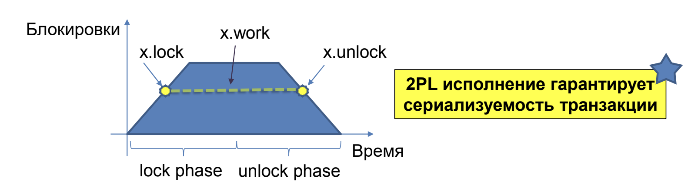
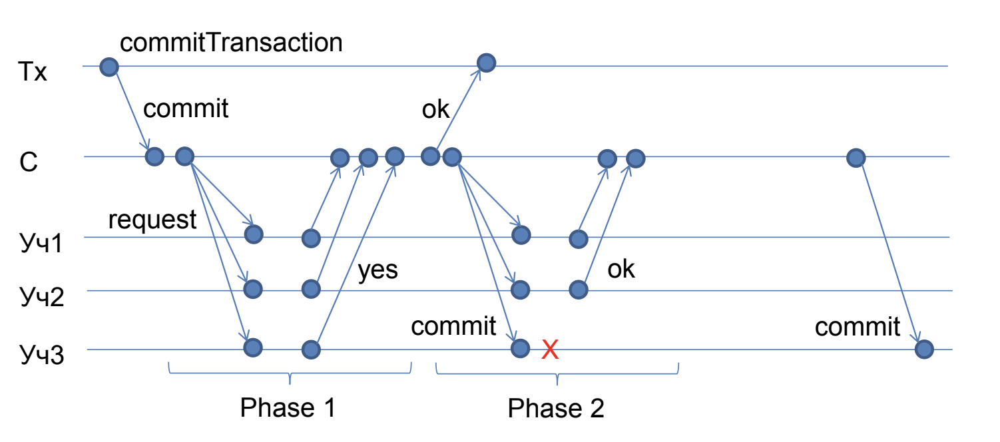

# Транзакции в распределённой системе

- Узлы участники транзакции хранят какие-то данные
- Множество данных между узлами не пересекается
- Хотим транзакционно работать с данными на разных узлах

```cpp
beginTransaction()
//
// do something with value
// stored in a distributed system
//
commitTransaction()
```

## ACID свойства транзакции

Транзакция это единица работы над множеством элементов,
хранящихся в базе данных.

- **Atomicity** (атомарность) – все изменения или ничего
- **Consistency** (согласованность) – перевод системы согласованное состояние в конце транзакции
- **Isolation** (изолированность) – параллельные транзакции не должны влиять друг на друга, а выполняться как будто бы последовательно
- **Durability** (надежность) – завершенные транзакции сохраняются даже в случае сбоев и перезапуска системы

### Atomicity: Ошибки в транзакциях

Ошибки могут нарушить атомарность транзакции. Нужно уметь откатить (rollback) транзакцию в случае ошибки.

Как это делать?

**Подход 1. Shadow Copy / Redo log**:

- Храним "собственную версию" данных в рамках транзакции (shadow copy)
- Не делаем изменения основной копии до завершения (commit) транзакции
- Откидываем свою копию её если транзакция откатывается
- Получается Redo log – журнал изменений которые надо применить только в случае завершения транзакции

**Подход 2. Undo log**:

- Храним «журнал отката»
- Вносим изменения в основную копию
- Запоминаем журнал по которому можно отменить (undo) все произведенные в транзакции изменения
- Если надо транзакцию откатить, то применяем undo log, чтобы отменить внесенные изменения

В каком случае используется тот или другой??? Ответ кажется был на лекции, надо расписать!

### Durability

При завершении транзакции надо обеспечить durability:

- Либо все **изменения** исходных данных записаны в энергонезависимую (non-volatile) память
- Либо **redo log** записан в энергонезависимую память
  - Более популярно на практике, по причинам того, что последовательный журнал писать быстрей как на диск, так и в распределенной системе

Это ли Write Ahead Logging????

### Consistency and Isolation

Максимальный **уровень изоляции** (isolation) level называется **сериализуемость** (serializability):

- Все транзакции можно переупорядочить в последовательную историю исполнения, так чтобы никакие две транзакции не выполнялись параллельно

Чтобы обеспечить согласованность и изоляцию транзакций часто применяют блокировку. Каждый элемент данных блокируется перед началом работы с ним и разблокируется после конца работы.

### Двухфазная блокировка (2PL)

Для 2-Phase Locking должны быть выполнены условия:

- Каждая транзакция состоит из 2-х последовательных фаз – фаза получения блокировок и фаза отпускания блокировок
- Блокировки могут браться и отпускаться в любом порядке в соответствующих фазах, при условии что каждая операция над элементом данных происходит после получения соответствующей ему блокировки и до её отпускания.



взаимная блокировка, иерархическая блокировка?????

## Двухфазный коммит (2PC)

Покуда у нас происходит работа с несколькими узлами сразу, то нужно уметь приходить к консенсусу о статусе транзакции (commit или rollback) при ее завершении.

Централизованный алгоритм завершения транзакции:

- У каждой транзакции есть выделенный transaction coordinator)
- **Фаза 1**: Запрос
  - Координатор спрашивает каждого участника о готовности к завершения транзакции
  - Участник может ответить "yes" только если он может обеспечить завершение даже в случае сбоя (т.е. он всё записал) и все данные корректны, иначе "no"
  - Транзакцию можно завершить только если все участники ответили "yes"
- **Фаза 2**: Завершение
  - Координатор принимает решение commit/abort и записывает его
  - Координатор доводит до участников решение

Transaction Commit == Consensus, поэтому к нему применим результат FLP. При отказе узлов или связи 2PC не сможет завершиться, до восстановления узлов/связи.

Иллюстрация отказа участника во 2-ой фазе:



При отказе координатора после принятия решения все будет хорошо, поскольку координатор свое решение уже записал и при перезапуске просто продолжит работу, разослав всем commit.

А если отказ произошел перед принятием решения, то участники транзакции пошлют координатору "no" (????), благодаря чему, когда он поднимется, оформит abort (rollback).
