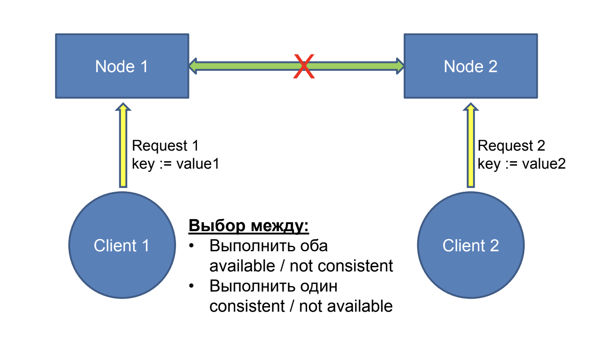
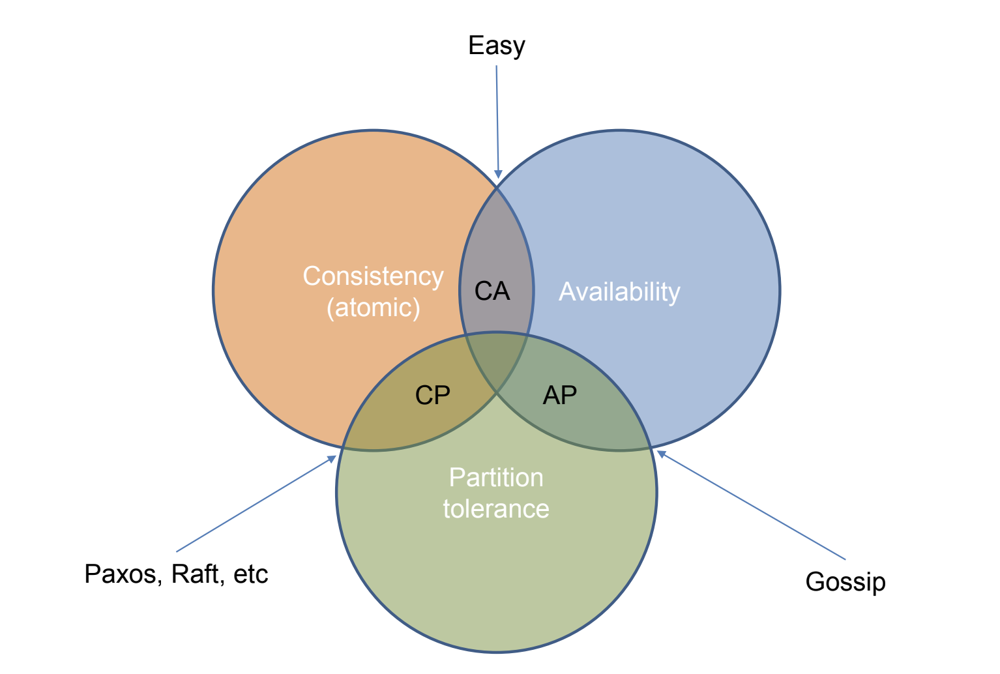

# Gossip-протоколы и CAP-теорема

## Network partitions

Paxos, Raft, etc позволяют системе хранения работать, возвращать согласованные данные (приходить к консенсусу), несмотря на отказы узлов.

Отказ или ненадежность связи это более серьезная проблема. Что делать если канал связи может отказывать, обрывая связь между узлами системы?

## CAP-теорема

Хотим три свойства от распределенных систем хранения:

- **Consistency** – все клиенты видят одинаковые данные (atomic/strong consistency)
- **Availability** – система работает несмотря на сбои узлов (запрос к не отказавшему узлу должен получить ответ)
- **Partition tolerance** – система работает несмотря на обрыв связи
между разными частями системы (partition)

Теорема гласит, что можно иметь только две из трех.

Что входит в Easy????

## Gossip-протоколы

- Узлы распространяют информацию друг другу по мере возможности
- В том числе то, что они узнали от других узлов – слухи (gossip)

Данное семейство протоколов умеет обеспечивать только eventual consistency, то есть при отсутствии сбоев через **какое-то** время все узлы системы будут знать согласованное состояние системы.

## ACID vs BASE

ACID - четыре свойства транзакций в БД.

BASE - ???

- CA = Atomicity, Consistency, Isolation, Durability
- AP = Basically Available, Soft state, Eventual consistency

## Конфликты

Когда слух с одной части сети дошел до другой и при этом они говорят об одном ключе, но разном значении, происходит конфликт - нужно договориться какое значение будет верным.

## CRDT или Conflict-free/Convergent/Commutative Replicated Data Types

CRDT оперирует состоянием системы. Операция в системе задается состоянием, в которое система приходит при применении этой операции к некоему начальному состоянию:

- $s_0$ - начальное состояние

- $x$ - состояние после применения операции $x$ к $s_0$

Операция объединения (merge) для состояния после
нескольких операций:

- $x$ - состояние после применения операции $x$
- $y$ - состояние после применения операции $y$
- $x \sqcup y$ состояние после применения $x$ и $у$

Множество состояний системы образует полугруппу с коммутативной и идемпотентной операцией объединения (merge) состояний:

- Коммутативность: $x \sqcup y = y \sqcup x$
  - Порядок операций не важен
  - Поэтому не нужен total order, то есть консенсус по поводу того в каком порядке операции происходили на разных узлах
- Идемпотентность: $x \sqcup x = x$
  - Повторное применение операции не меняет состояние
  - Поэтому не нужна **reliable** доставка, то есть **exactly once delivery**
- Полугруппа (ассоциативность): $(x \sqcup y) \sqcup z = x \sqcup (y \sqcup z)$
  - Можно объединять операции в любом порядке

### Увеличивающийся счетчик

- Операция: Добавить $x$ к значению счетчика
- Состояние: Множество операций
- Операция коммутативна
  - По множеству операций мы можем восстановить значение счетчика
  - Но нужно, чтобы у все был участников было общее мнение о множестве проведенных операций
  - В случае сбоя множество операций может оказаться разным
  - Нужен gossip протокол (пересылать другим услышанные операции)
  - Могут дублироваться операции (см. ниже)
- Нужна идемпотентность
  - Добавим уникальной идентификатор каждой операции

Проблемы? Масштабируемость по числу операций.

### Увеличивающийся счетчик 2

- Операция: Добавить $x$ к значению счетчика
- Физическое состояние: Вектор размером в число узлов
  - Каждый узел увеличивает только свою компоненту
- Логическое состояние: Сумма элементов вектора
- Объединение состояний: Покомпонентный $max$
  - Здесь важно что счетчик только растет!
  - Это коммутативная и идемпотентная операция
- Рассылаем через gossip текущее известное состояние
  - Оно не растет в размере со временем!
  - Но каждый раз надо пересылать $O(N)$ значений

## $\delta$-CRDT

Как и CRDT на основе состояний, но пересылаем только отличие (delta) состояние от базового.

Пример: Если узел $i$ увеличил счетчик, то пересылаем не весь вектор, а только карту $\{i \to x_i\}$

Merge: Объединение карт и покомпонентный max.

Каждому соседу в gossip надо посылать только дельту по сравнению с предыдущим посланным ему значением, то есть только значения поменявшихся ключей в карте.

В стабильной системе одна операция вызывает распространение сообщения размером $O(1)$.

## Другие CRDT

- **Счетчик вверх и вниз**
  - Два счетчика: увеличение и уменьшение
- **Растущее множество**
  - Рассылаем и объединяем множества (или дельты по сравнению с
предыдущим состоянием)
- **Множество с операций удаления**
  - Два множества: добавленных и удаленных элементов
  - Проблема: множество удаленных элементов растет вечно
  - Решение: Экспирация удаленных элементов со временем
- **Карты**
  - Как и множества
