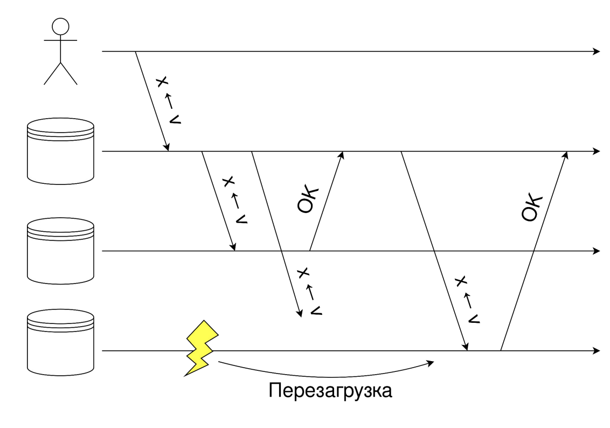
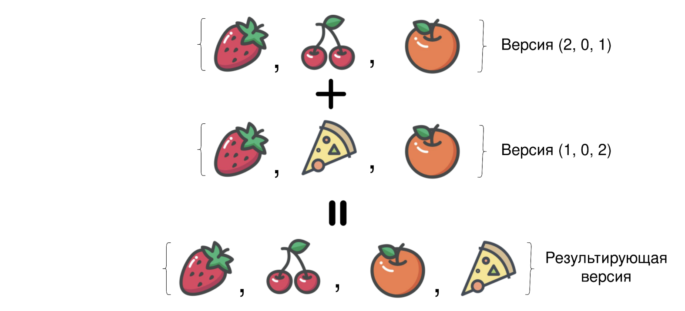
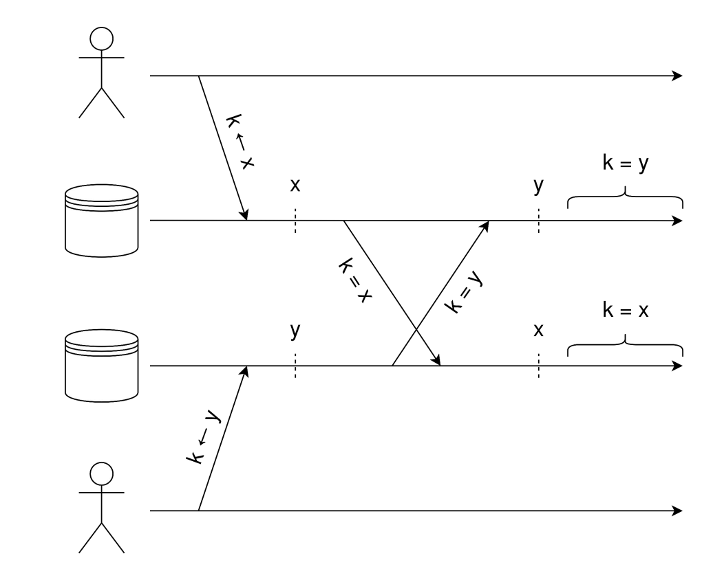
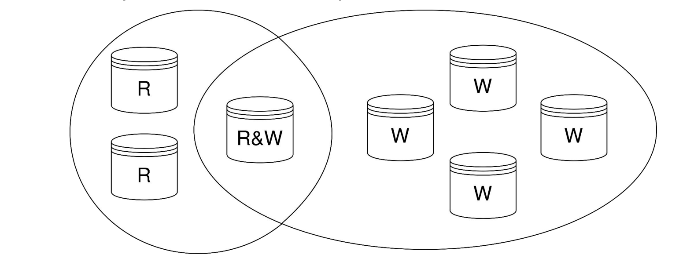
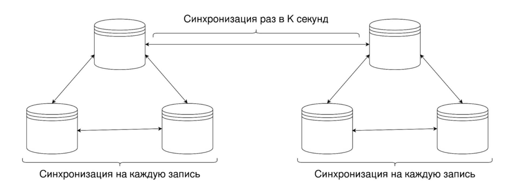

# Asynchronous multi-master replication

## Репликация со строгой консистентностью

Для завершения операции нужно завершить репликацию на кворум. В случае разделения сети клиенты на меньшей половине не могут исполнять запросы.

В случае разделения сети иногда клиенты вообще не
могут исполнять запросы (если ни у кого не набирается кворум).

## Асинхронная репликация

- Реплика отвечает клиенту немедленно
- Завершает репликацию в фоне
- **Любая** реплика может принять запрос на запись
- Реплицируем на сервер пока он не подтвердит получение записи

Можем вспомнить про Gossip-протоколы и не заставлять сервер, в который прилетело изменение от клиента, заниматься репликацией самостоятельно.

Gossip-протоколы относятся к AP-категории в CAP-теореме, поэтому для них характерна работа во время разделения сети. Когда сеть восстановится, необходимо договориться о том, у кого правильные значения.

## Векторные версии

- Для каждого ключа храним не только актуальное значение, но и векторную версию $\N^n$
- $n$ - число процессов
- $v_i$ - количество обновлений с $i$-ой реплики

Каждое успешное обновление увеличивает локальную компоненту $v$ только у изменённого ключа.

Пришедшее с другой реплики значение заменяет локальное, если $v_{local} \le v_{repl}$. Это значит, что реплика видела те же изменения, что и мы и даже больше. Иначе, отбрасывается.

Если векторные версии не сравнимы, значит произошёл конфликт, и мы должны решить его, учтя оба значения.

### Разрешение конфликтов

При разрешении конфликта мы берём покомпонентный максимум версий в качестве результирующей версии.

1. Объединение множеств

    

    Можем потерять удаление, если параллельно с ним произошло добавление.
2. Разрешение конфликтов на стороне СУБД

    ????
3. Отдать конфликт пользователю

    Требует после покомпонентного максимума сделать ++ на локальной версии.

### Повторные конфликты

- Возникают при параллельном разрешении конфликта на разных репликах
- Не можем полагаться на детерминированное разрешение конфликта
- Приходится решать конфликт ещё раз

### Изменение состава кластера

- Физически версии храним не в векторе, а в хеш-таблице
- Отсутствие значения воспринимаем как ноль изменений
- Удаляем версию из хеш-таблицы, если считаем реплику отказавшей
- В случае если реплика жива, посчитаем, что видели с неё ноль обновлений

## Last Write Wins

Нельзя просто независимо оставить на каждой реплике последнюю пришедшую запись - получим несогласованность, которая никогда не разрешится.

Пример:

Поэтому оставляем последнюю в смысле happens-before запись. В случае несравнимости векторов выбираем по какому-то скалярному критерию:

- `node.pid`
- `value.write_timestamp`
- `hash(value)`
- ...

Переход от векторной версии к паре чисел ?????

## Sloppy Quorum

- Если мы читаем всего с одной реплики, велик шанс прочитать устаревшее значение
- Если мы пишем всего на одну реплику, велик шанс записать на очень медленно реплицирующий сервер
  - Другие клиенты не прочитают наше значение

Запись:

- Дожидаемся успешной записи на $W$ серверов

Чтение:

- Дожидаемся ответа от $R$ реплик
- Мёржим или делаем Last-Write-Wins, если получили разные ответы

Если $W + R > N$, то любая успешная запись будет прочитана. Иначе просто повышаем вероятность этого. (???)

Недостатки:

- Это не настоящий кворумный алгоритм
- Возможны нелинеаризуемые чтения
- Возможны пропадающие записи

Надо расписать!!!!!

## Hinted Handoff

Представим, что мы не можем накатить запись на $W$ реплик нужного шарда. Давайте запишем на другой шард - он запомнит эту запись.

Другой шард накатит запись на нужный шард, когда последний снова станет доступен. Так мы увеличиваем надёжность записи.

## Масштабирование

- Репликация хорошо помогает при масштабировании чтения
  - Каждый клиент читает с произвольного сервера
- Репликация плохо помогает при масштабировании записи
  - Каждая запись должна дойти до каждого сервера
  - Хорошо помогает шардирование

Давайте реплицироваться не на каждую запись, а периодически, и плюс за счёт слияния записей по одному ключу будем реплицировать меньше данных (то есть, воспользуемся батчингом).

## Топологии репликации

В простейшем случае граф репликации - полный граф.

Но это плохо работает в случае географической распределённости - делать репликацию через океан на каждую запись долго.

Предлагается делать так:

- Внутри датацентра задержки небольшие и полная топология репликации
- Между датацентра задержки гораздо больше и репликация происходит только между "главными" серверами ДЦ (но может происходить и между несколькими парами - для защиты от сбоев)

