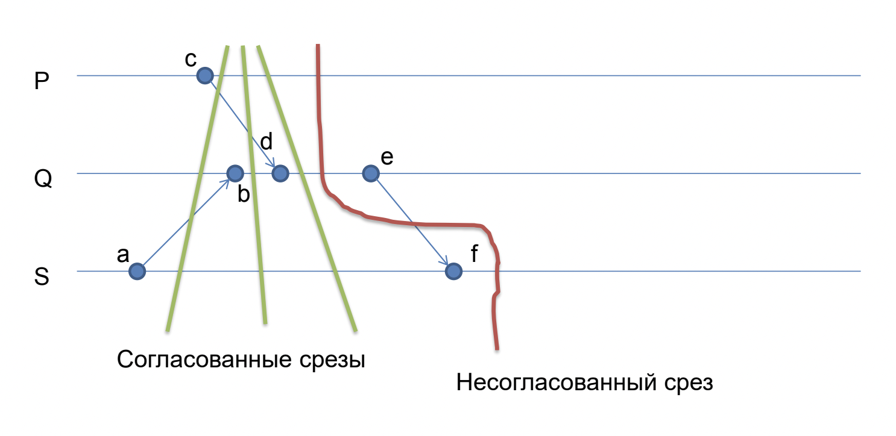
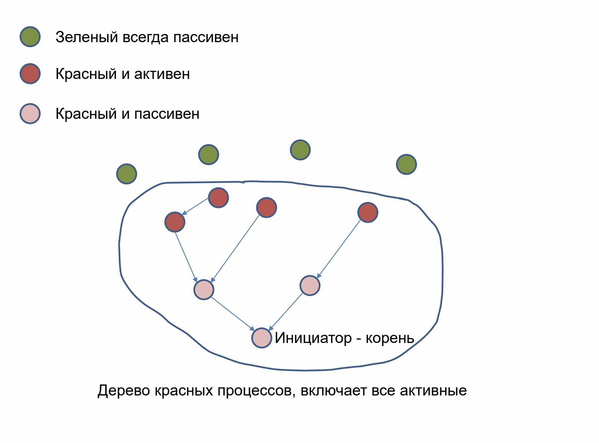
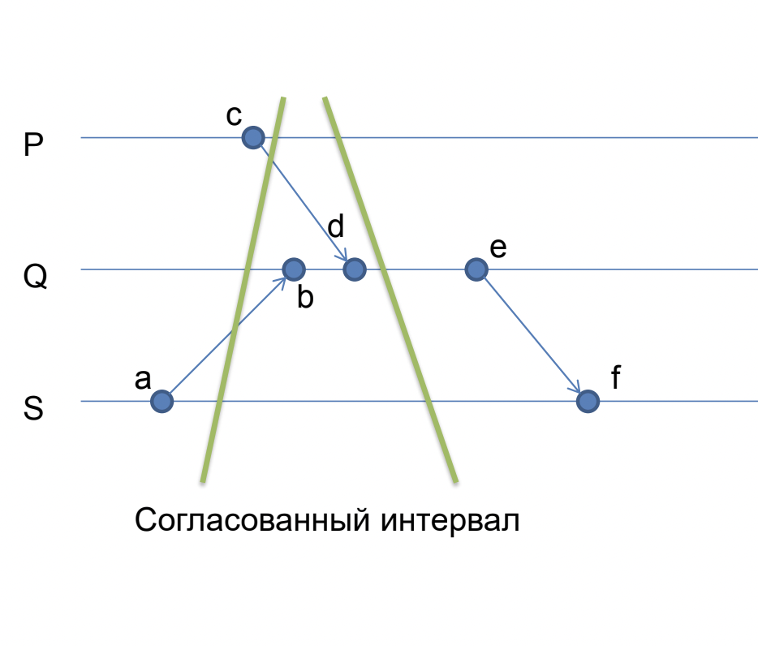
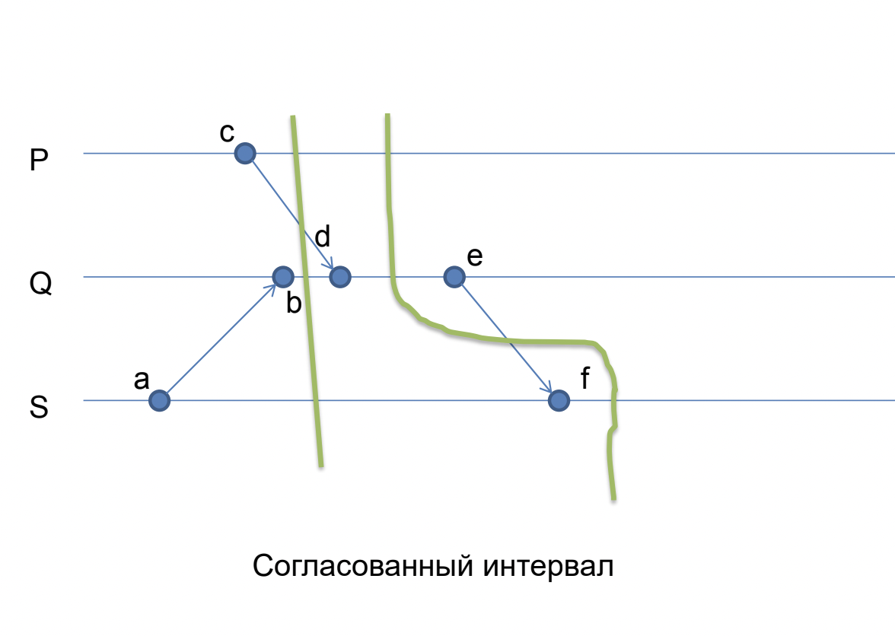
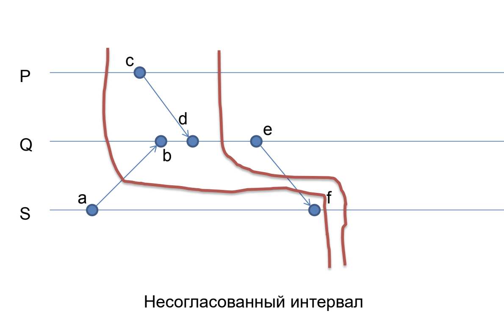

# Глобальное состояние, согласованные срезы и предикаты

## Согласованное глобальное состояние (срез)

Если у распределенной системы нет «глобального состояния»,
то как запомнить её состояние на диске, чтобы можно было
продолжить работу после восстановления с диска?

Любое $G \subset E$ называется срезом тогда и только тогда, когда:
$$\forall e \in E, f \in G : e < f \implies e \in G$$

$G$ является согласованным срезом тогда и только тогда, когда:
$$\forall e \in E, f \in G: e \to f \implies e \in G$$

Или, эквивалентное определение:
$$\nexists e\in E \backslash G, f \in G: e \to f$$

Разница в том, что обычный срез допускает невзятие события, послужившего причиной одного события из среза. Это происходит потому, что мы берем $e < f$, что подразумевает события из одного процесса. Чтобы корректно учитывать межпроцессные взаимодействия, нужно просить отношение произошло-до.

По сути согласованный срез - это транзитивное замыкание по тем событиям, которые мы первоначально "захватываем" в наш срез, по отношению произошло-до.

## Алгоритм Чанди-Лампорта получения согласованного среза

Для его работы необходима FIFO-гарантия отправки-получения собщений.

- Сначала все процессы белые (**w**)
- Процесс-инициатор:
  - Запоминает свое состояние и становится красным (**r**)
  - Сразу же посылает токен всем соседям
  - Следующие события этого процесса не войдут в срез
- При получении токена белый (**w**) процесс:
  - Запоминает свое состояние и становится красным (**r**)
  - Сразу же посылает токен всем соседям
  - Следующие события этого процесса не войдут в срез
- При получении токена красный (**r**) процесс ничего не делает

Почему не может получиться несогласованный срез?

Обратимся к определению номер 2. Чтобы срез был несогласованным, достаточно наличие одного события $e$, который не попал в срез, но который имеет с событием $f$ из среза отношение произошло-до: $e \to f$.

$f$ - событие из среза, взятого алгоритмом, значит $proc(f)$ (*процесс, на котором произошло событие* $f$) стал красным после того, как получил событие $f$.

По той же логике, событие $e$ случилось после того, как $proc(e)$ стал красным. Если наши сообщения идут FIFO, то $proc(e)$, став красным, должен был сначала разослать всем процессам токен, а затем послать $e$.

Значит, $proc(f)$ сначала стал бы красным, если он не был красным, а только потом получил бы $f$. Вначале условие было наоборот, значит, противоречие. Значит, алгоритм получает согласованный срез. $\square$

### Сохранение сообщений

Уметь из согласованного среза просто восстанавливать события - недостаточно. Необходимо уметь перепосылать сообщения, которые были посланы, но в срез не попали.

Классифицировать сообщения можно по цвету процессов:
- ww (отправлено из среза, вошло в срез)
- wr (отправлено из среза, не вошло в срез)
- rr (отправлено не из среза, невошло в срез)
- rw (отправлено не из среза, вошло в срез)

Ясен пень, что последнего случая в согласованном срезе быть не должно, а wr-сообщения необходимо перепосылать после восстановления из среза - это наши "сообщения в пути".

Варианты реализации:
- Запоминание на стороне отправителя
- Запоминание на стороне получателя

### На стороне отправителя
- Белый процесс (**w**) высылает подтверждение (ack) на каждое полученное сообщение
- Получивший ack процесс знает, что сообщение уже можно не хранить и удаляет его из буфера хранения
- Получив токен от адресата красный (**r**) процесс-отправитель знает что все неподтвержденные сообщения, которые посылались адресату, надо сохранить

### На стороне получателя
- Красные (**r**) процессы сохраняют сообщения, полученные от белых (**w**) процессов
- Получение токена от процесса означает, что больше таких сообщений от него не будет

## Глобальные свойства

Глобальное свойство - это предикат, определенный над состоянием системы в целом.

Примеры:
- Какой-то процесс владеет токеном
- Не более чем один процесс работает с каким-то ресурсом
- Система попала в deadlock
- Распределенный алгоритм остановился
- Согласованность состояния распределенной системы (постоянная сумма денег на счетах в банке и т.п.)

Но что такое "состояние системы"? Это должен быть согласованный срез.

## Стабильные и нестабильные предикаты

Предикат $P(G)$ **стабильный** если для согласованных срезов $G$ и $H$ выполняется:
$$P(G)~\&~G \subset H \implies P(H)$$

То есть если предикат случился, то он случился навсегда. Примеры: потеря токена, deadlock и т.п.

Как считать стабильный предикат в лоб:
- Берем периодически согласованный срез (Чанди-Лампорт)
- Если предикат верен, значит будет верен и в дальнейшем
- Но построение согласованного среза дорого - $O(N^2)$ сообщений
- Научимся эффективней в специальных случаях

**Локальный** предикат – это предикат по состоянию одного процесса.

Если предикат - это дизъюнкция локальных предикатов, то всё просто (если в одном процессе "истина", то глобально тоже истина).

А если конъюнкция? Как определить истинность нестабильного конъюнктивного предиката, если есть разные срезы?

## Слабый конъюнктивный предикат

Пусть предикат $P$ имеет вид конъюнкции локальных предикатов над состоянием каждого процесса:
$$P = L_1~\&~L_2~\&~...~\&~L_n$$

Пример предиката $P$: "в системе нет координатора" (локальное условие "я не координатор").

Слабый конъюнктивный предикат **истинен**, если он истинен на хотя бы одном согласованном срезе.

Сложные предикаты, являющиеся логической комбинацией локальных предикатов, всегда можно представить в нормальной дизъюнктивной форме и рассматривать как дизъюнкцию слабых конъюнктивных предикатов

### Алгоритм с координатором:
- Каждый работающий процесс отслеживает свое векторное время $VC$
- При наступлении истинности локального предиката $L$ [увеличиваем свою компоненту вектора времени] и посылаем сообщение координатору $С$, [указывая векторное время, когда это произошло]
- В этом случае, любой срез можно однозначно задать вектором времен $VC$

Координатор поддерживает в памяти время $VC$ каждого процесса, и когда эти векторные часы становятся все попарно несравнимы, срез считается согласованным, а предикат - выполненным.

Наблюдения:
- Для сравнения векторов на 2-х процессах достаточно только соответствующих компонент
- Для хранения среза кандидата достаточно только одного вектора с соответствующими компонентами (?)

### Улучшенный алгоритм с координатором:
- Координатор хранит вектор среза-кандидата и флажок для каждой его компоненты:
  - Красный – этот элемент не может быть частью согласованного среза
  - Зеленый - может
- Начальное состояние: всё по нулям, красное
- Обрабатываем приходящие сообщения только от красных процессов (сообщения от зеленых ставим в очередь (?))
- Сравниваем пришедший вектор попарно с другими процессами (сравниваются только две соответствующие компоненты)
  - Если новый вектор больше (нарушилась попарная несравнимость), то делаем меньший процесс красным
  - После обработки сообщения от процесса его делаем зеленым
- Если всё зеленое, значит нашли согласованный срез!

Утверждается, что этот алгоритм корректен и никогда не пропустит согласованный срез с выполненным предикатом.

### Распределенный алгоритм:
- Каждый процесс имеет своего собственного координатора
- Процессы шлют сообщения (как раньше) своим координаторам, а координаторы общаются между собой
  - Координаторы пересылают друг другу срезы-кандидаты и свои(?) флажки (зеленый/красный)
- Красные координаторы обрабатывают сообщения от своих процессов (как раньше)
- После обработки сообщения становятся зелеными
- Если в процессе обработки они пометили красным другой процесс, то шлют сообщение его координатору

Нужно расписать!!!!!!

## Специальные случаи стабильных предикатов

- Остановка системы, например, при поиске кратчайшего пути
  - Обобщим для так называемых диффундирующих вычислений
- Взаимная блокировка при распределении ресурсов
  - Обобщим для так называемых локально-стабильных предикатов

Распределенный алгоритм Дейкстры. Поиск кратчайшего пути от инициатора до всех остальных узлов.
- Каждый узел поддерживает кратчайшее расстояние до источника, в начале у всех узлов $d = \infty$
- Инициатор – источник. У него $d = 0$
- Инициатор шлет всем соседям сообщение "distance 0"
- Узлы получив сообщение "distance $d_r$" по ребру стоимости $d_e$ обновляют расстояние у себя
$$d = \min(d, d_r + d_e)$$
- Если расстояние обновилось, то высылают соседям "distance $d$"

Рано или поздно алгоритм найдет все кратчайшие d, но как узнать, что он закончил работу?

## Диффундирующие вычисления

В диффундирующем вычислении процессы бывают в двух состояниях:
- Активные и пассивные
- Получение сообщения делает процесс активным
- Только активный процесс может посылать сообщения
- Активный процесс может в любой момент стать пассивным
- Алгоритм начинается с одного активного процесса-инициатора

Проблема останова: как инициатор может узнать о том, что алгоритм завершился?

### Алгоритм Дейкстры-Шолтена:
- Выстраиваем процессы в дерево
- Требуем подтверждение (ack) на каждое сообщение
  - Считаем баланс (сколько послали сообщений минус сколько подтверждений получили)
- Назовем процесс "зеленым" если он
  - Пассивен
  - У него нет детей в дереве (childCount = 0)
  - У него нет неподтвержденных сообщений (balance = 0), то есть исходящий канал пуст
- В противном случае будем считать процесс "красным"
- Дерево будет содержать все "красные" процессы
- Каждый процесс в дереве будет знать parentId

Продолжение:
- "Зеленый" процесс (не в дереве) при получении сообщения становится новым листом в дереве (и "красным")
  - Делает parentId := sourceId (от кого получили сообщение)
  - Шлет сообщение в parent "я твой новый child"
  - Получив это сообщение, parent делает childCount++
- Пассивный лист дерева (без детей) при отсутствии неподтвержденных сообщений удаляет себя из дерева (становится "зеленым")
  - Шлет сообщение в parent "я больше не твой child"
  - Получив это сообщение, parent делает childCount—
- Когда корень дерева (инициатор!) становится "зеленым", то диффундирующее вычисление завершено

## Локально-стабильные предикаты

Пара срезов $F, G \subset E$ называется интервалом если $F \subset G$. Обозначение: $[F, G]$

Интервал называется согласованным, если:
$$\forall e \in E, f \in F: e \to f \implies e \in G$$

Эквивалентно:
$$\nexists e \in E \backslash G, f \in F: e \to f$$

Это обобщает определение согласованного среза если $F = G$.

Примеры:

Теорема:

Интервал $[F, G]$ согласован тогда и только когда, когда внутри него
есть согласованный срез $H$:
$$F \subset H \subset G$$

### Барьерная синхронизация

Интервал $[F, G]$ барьерно-синхронизирован если:
$$\forall f \in F, g \in E \backslash G: f \to g$$

Теорема: Любой барьерно-синхронизированный интервал согласован.

Построение барьерной-синхронизации (3 алгоритма):
- Через координатора
- Посылка каждый-каждому
- Посылка токена два раза (по кругу)

### Локально-стабильные предикаты

Локально-стабильный предикат - стабильный предикат, определяемый группой процессов, у которых не меняется состояние

Пример: Взаимная блокировка
- Предикат – есть цикл в графе ожидания
- Все процесс попавшие в цикл ничего не делают (ждут)
- Важно! Нужен согласованный срез
- Алгоритм поиска с использованием барьерной синхронизации

Нужно больше информации!!!!!