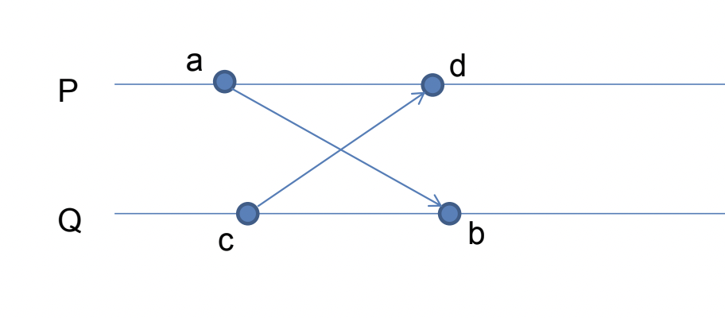
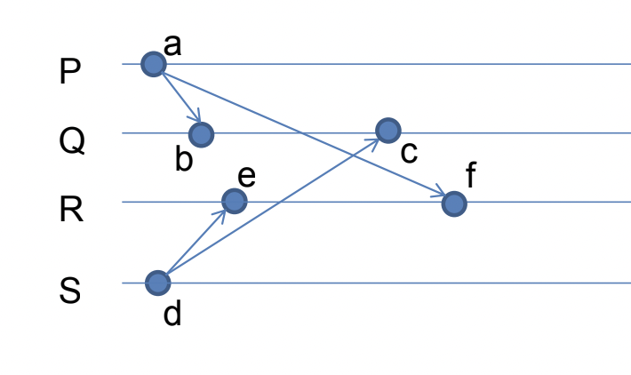

# Упорядочивание сообщений

## Иерархия порядков

- Асинхронный
- FIFO
- Причинно-согласованный
- Синхронный

## FIFO-порядок

Не бывает пар сообщений m и n упорядоченных неверно!

$$\nexists m,n \in M: snd(m) < snd(n)~\&~rcv(m) < rcv(n)$$

Здесь "$<$" это отношение порядка в одном процессе.

### Алгоритм:
- Нумеруем все сообщения между парой $P$ и $Q$
- На стороне получателя есть "номер ожидаемого сообщения"
- Условие обработки: номер пришедшего сообщения = ожидаемый
- Сообщения пришедшие "неожиданно" складываются в очередь

Проблемы? Использует $<$ вместо "произошло-до". Значит, посылка двух пакетов из источника к узлу - напрямую и через посредника - может привести к реордерингу.

## Casual-order (причинно-согласованный порядок)

Не бывает пар сообщений m и n упорядоченных неверно!

$$\nexists m,n \in M: snd(m) \to snd(n)~\&~rcv(m) \to rcv(n)$$

### Алгоритм с координатором:
- Выберем координатора, который будет осуществлять передачу
- Каналы до координатора FIFO
- Координатор, получая пакет, посылает его до места назначения
- Получаем casual-order автоматически

### Распределенный алгоритм:

Используем матричные часы!
- $M_{ij}$ - количество сообщений, посланных от $P_i$ к $P_j$
- Перед посылкой сообщения делаем $M_{ij} = M_{ij} + 1$ и шлем матрицу $M$

Условия обработки сообщения (все должны быть выполнены):
- Пусть процесс $P_i$ получил сообщение от $P_j$ с матрицей $W$.
- Выполнено FIFO: $W_{ji} = M_{ji} + 1$
- Casual-order: $\forall k \neq j: M_{ki} \ge W_{ki}$
- После обработки: $M = \max(M, W)$

Ну в общем понятно, что это значит - мы обрабатываем сообщение только тогда, когда знаем, что получили все сообщения, посланные нам до этого сообщения.

Проблемы: надо матрицы по сети гонять.

## Синхронный порядок

Всем событиям можно сопоставить время $T(m)$, так что время событий $T(rcv(m)) = T(snd(m)) = T(m)$:
$$\forall e, f \in E: e \to f \implies T(e) < T(f)$$

Пример нарушения синхронного порядка (причинно-согласованность не нарушена): почему порядок нарушен????????

### Алгоритм:
- Процесс может быть в активном или пассивном состоянии (изначально все активны)
- Пассивный процесс не отправляет сообщения и не принимает (складывает в очередь), пока не станет активным
- Сообщение - большое, если номер отправителя больше номера получателя, и малое иначе
- Если процесс хочет отправить большое сообщение, то он его отправляет и ждёт подтверждения. А пока ждёт — становится пассивным.
- Если процесс хочет отправить маленькое сообщение, то сначала шлет запрос-разрешение (req), оставаясь активным. Процесс-адресат отправляет нам ack, становясь пассивным, и ждет нашего сообщения. В конце концов, мы получаем сообщение.

Таким образом, сообщения по факту "передаются" только от больших к маленьким и тогда можно нарисовать стрелочки. ????

В системе не может произойти взаимная блокировка из-за иерархии процессов (при любой коммуникации пассивным становится больший процесс).

# Массовая рассылка сообщений

Broadcast – от одного всем другим процессам

Multicast – от одного множеству других процессов

## Общий порядок (total order)

Только для случая, когда одно сообщение идет многим получателям ($rcv_p$ с индексом процесса-получателя $P$):

$$\nexists m, n \in M; p, q \in P: rcv_p(m) < rcv_p(n)~\&~rcv_q(n) < rcv_q(m)$$

Пример нарушения ($P$ рассылает $m$, $S$ рассылает $n$):

### Алгоритм с координатором:
- Выберем координатора с FIFO-каналом
- Отсылаем ему сообщение и список адресатов
- Координатор занимается массовой рассылкой
- Получаем общий и причинно-согласованный порядок

### Алгоритм Лампорта:

Это очень похоже на задачу о блокировке в распределенной системе. Мы можем попросить "мьютекс", и только потом транслировать свои сообщения.

- Ведем логические часы, "билетик" задает порядок обработки сообщений
- Рассылаем всем запрос [req] на рассылку
- Подтверждения [ok] отсылаются каждым процессом сразу же.
- Когда получили подтверждения от всех и мы первые в очереди, посылаем сообщения **всем** [send/release]. Вместо настоящего можно послать пустышку тем, кому оно не должно идти.

Особенности:
- Нужен FIFO
- Посылаем сообщения всем (даже если multicast)

### Алгоритм Скина:

Оптимизируем алгоритм Лампорта.

- Номер билета вычисляется только при получении подтверждения от всех
- Работает не только для broadcast, но и для multicast
- Не требует FIFO

У каждого процесса есть очередь принятых необработанных multicast сообщений. Каждое сообщение имеет временну́ю метку и флаг  "финализирована ли метка".
- Инициатор отправляет сообщение и своё время (предварительное время сообщения) всем получателям
- При приеме сообщения процесс запоминает сообщение со временем в очередь (как нефинализированное) и отправляет свое время инициатору
- Когда инициатору вернулись все подтверждения, он выбирает максимальное время из них и снова отправляет сообщение с финализированным временем
- Получатель может обработать сообщение, если оно помечено как финальное и имеет минимальное время среди всех известных получателю сообщений (и финальных, и нефинальных; иначе может получиться, что финализация сообщений произойдёт в разном порядке у разных получателей и нарушится общий порядок)

Итого: $3k$ сообщений на каждый multicast из $k$ сообщений.
