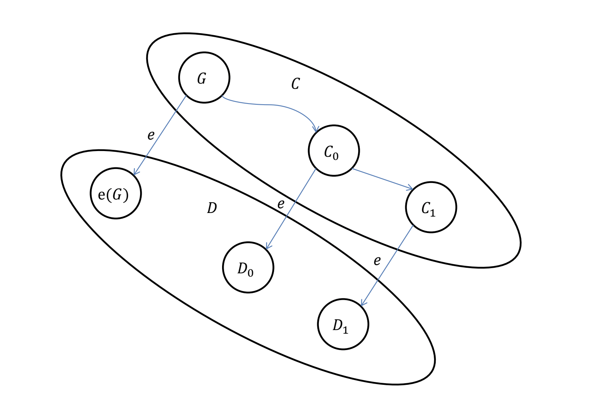
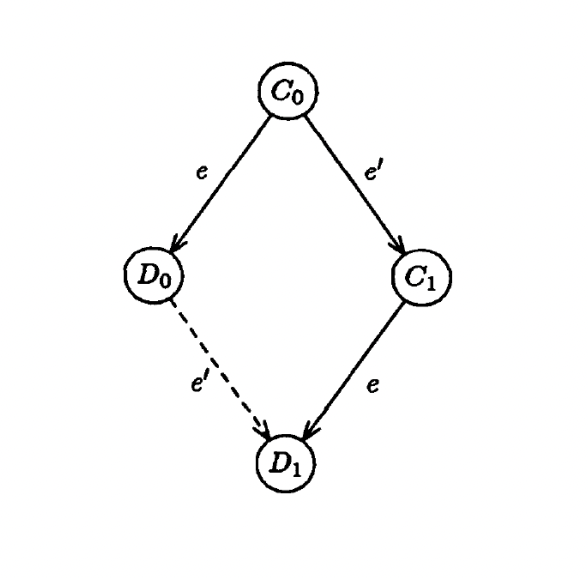
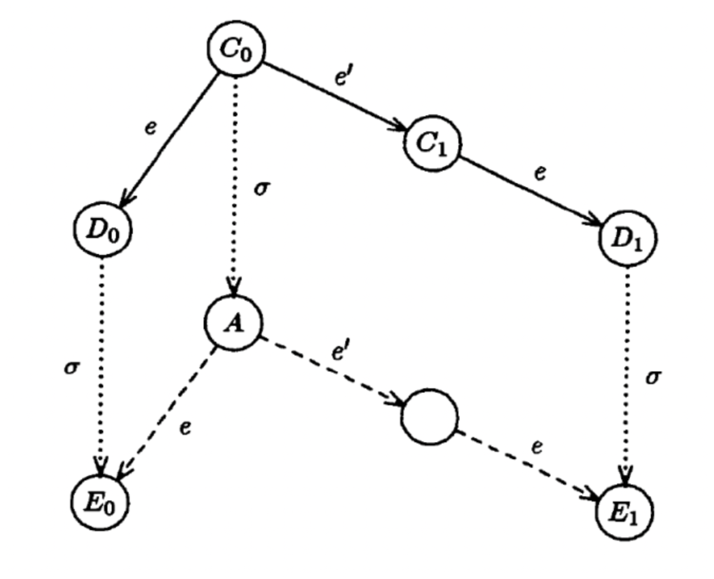

# Иерархия ошибок/отказов

Более сложный отказ может моделировать более простой.

Умеем работать при сложном -> сможем при простом.

- Отказ узлов (хостов)
- Отказ каналов (проводов, например)
- Ненадежная доставка (пакеты могут приходить через один или испорченными; можно проэмулировать полный отказ канала, сказав, что теряются всегда)
- Византийская ошибка (пакеты могут приходить корректными, но передающими некорректное состояние)

### Синхронные системы
- Время передачи сообщений ограничено сверху
- Можно разбить выполнение алгоритма на фазы

### Асинхронные системы
- Время передачи сообщений не ограничено сверху
- Но время передачи конечно, если нет отказов

## Задача о консенсусе в распределенной системе

- Каждый процесс имеет свое предложение (proposal)
  - Может быть один бит, число, или что-либо другое
- Все процессы должны прийти к решению (decision)
- Приход к решению это некий распределенный алгоритм

Свойства:
- Согласие (agreement)
  - Все (не отказавшие) процессы должны завершиться с одним и тем же решением
- Нетривиальность (non-triviality)
  - Должны быть варианты исполнения приводящие к разным решениям
  - Более сильное требование называется обоснованность – решение должно быть предложением одного из процессов
- Завершение (termination)
  - Протокол должен завершиться за конечное время

### Консенсус в системе без отказов

- Каждый процесс шлет свое предложение всем остальным
- Дожидается N-1 предложений от других процессов
- Теперь из N предложений выбираем решение
  - Используя любую детерминированную функцию над множеством предложений, например, минимум из всех предложений
  - Любая нетривиальная детерминированная функция подойдет!

Алгоритм работает и в асинхронной системе: неважно как долго идут сообщения, главное, чтобы не было отказов.

## Теорема FLP

Авторы: Флетчер, Линч, Патерсон, 1985 год

Важные предпосылки:
- Система асинхронна (нет предела времени доставки сообщения)
- (Один) узел может отказать
- Консенсус надо достичь за конечное время

Теорема гласит, что в ее условиях невозможно достичь консенсуса N процессам даже на одном бите.

### Условия (модель)

Процесс - детерминированный автомат с методами:
- `msg receive()` - блокирующая операция
- `send(msg)`
- `decided(value)` - когда надо принять решение

Конфигурация - это:
- Состояние всех процессов
- Все сообщения в пути (отправленные и не полученные)

Шаг от одной конфигурации до другой:
- обработка какого-то сообщения процессом (событие)
- внутренние действия этого процесса и посылка им от нуля до нескольких сообщений до тех пор, пока процесс не перейдет к ожиданию следующего сообщения.
  - Детерминировано (однозначно) определяется событием (!)

Начальная конфигурация содержит начальные данные для каждого из процессов:
- Не обязательно один бит, а сколько угодно входных данных
- Каждый процесс может иметь свою программу

Исполнение - это бесконечная цепочка шагов от начального состояния, ибо процессы продолжают выполняться и после принятия решения.

**Отказавший** процесс делает только конечное число шагов в
процессе исполнения, и такой процесс максимум один, а каждый из остальных (не отказавших) процессов делает бесконечное число шагов.

Доставка надежная - любое сообщение для не отказавшего процесса обрабатывается через конечное число шагов, и сообщения не теряются.

Так как есть согласие, то все процессы пришедшие к решению
имеют одно и то же решение (0 или 1).

Из-за возможности отказа одного процесса, даже если один
процесс не делает шагов, то все остальные должны прийти к
решению за конечное число шагов.

### Валентность
Конфигурация называется:
- $i$-**валентной**, если все цепочки шагов из неё приводят к решению i (0-валентные и 1-валентные конфигурации)
- **бивалентной**, если есть цепочки шагов, приводящие к решению 0, так и цепочки шагов, приводящие к решению 1

### Коммутирующие события
Цепочки шагов с событиями на разных процессах коммутируют и приводят к одной и той же конфигурации, если поменять их порядок выполнения.

Очень логичное требование, поскольку на деле так и работает.

### Лемма 1: Существует (начальная) бивалентная конфигурация

От противного. Если не существует (начальной) бивалентной конфигурации, значит все конфигурации одновалентны:

- Из нетривиальности есть как 0- так и 1-валентные
- Значит найдем пару начальных конфигураций разной валентности, отличающихся начальным состоянием только одного процесса
- Но этот процесс может отказать (не исполняться) с самого начала, и тогда одна и та же цепочка шагов (других процессов) приводящая к решению возможна как в одной (0-валентной) конфигурации, так и в другой (1-валентной) конфигурации. Противоречие.

### Лемма 2: Для бивалентной конфигурации можно найти следующую за ней бивалентную

Если $G$ бивалентная конфигурация, и $e$ это какое-то событие (процесс $p$ и сообщение $m$) в этой конфигурации, то возьмем:
- $C$ – множество конфигураций достижимых из $G$ без $e$
- $D$ – множество конфигураций $D$ = $e(C)$, то есть конфигураций где
$e$ это последнее событие

Иллюстрация:

Докажем, что $D$ содержит бивалентную конфигурацию:
- Тем самым придем к противоречию с достижением консенсуса за конечное число шагов и докажем теорему
- По сути, мы воспользуемся асинхронностью: нет предела на время обработки сообщения, а значит любое сообщение можно отложить на любое конечное время
- Докажем лемму 2 от противного. Предположим что $D$ не содержит бивалентных конфигураций

### Лемма 2.1, $i$-валентные конфигурации

Докажем что есть $i$-валентная конфигурация в $D$ для любого $i$ (0 или 1).

Так как $G$ бивалентная конфигурация, то по какой-то цепочке шагов из неё можно дойти до $i$-валентной $E_i$.
- Если $E_i \in D$, то мы нашли искомую конфигурацию
- Если $E_i \in C$ то тогда $e(C) \in D$ искомая конфигурация
- В противном случае $e$ применялась в цепочке шагов для достижения $E_i$ из $G$, а значит есть $F_i \in D$ (сразу после применения $e$) из которой доступна $E_i$ по какой-то цепочке шагов
  - Но так как мы предположили, что в $D$ нет бивалентных конфигураций, то $F_i \in D$ будет $i$-валентной

### Лемма 2.2, Соседние конфигурации

Найдем такие соседние (отличающиеся одним шагом $e'$) $С_0 \in С$ и $С_1 \in С$, что $D_0 = e(C_0) \in D$ является 0-валентной, а $D_1 =
e(C_1) \in D$ является 1-валентной (например).

> См. иллюстрацию выше.

Пусть, не теряя общности, $C_0 = e'(C_1)$, где событие $e'$ произошло на процессе $p'$ (не забываем, что процесс $p$ связан с событием $e$).

Как это сделать:
- Пусть, не теряя общности, конфигурация $e(G) \in D$ является 0-валентной (если она 1-валентная, то симметрично) - она соответствует пустой цепочке шагов из $G$.
- Тогда по лемме 2.1 в $D$ есть 1-валентная конфигурация $D_1 = e(C_1) \in D$
- Будем убирать из цепочки шагов ведущей от $G$ к $C_1$ по одному шагу с конца, пока не найдем искомую пару соседей $С_0$ и $С_1$

Так найдем $C_0$. Возможно, ей окажется только $G$.

### FLP. Разбор случая 1

Если $p \ne p'$ то $e$ и $e'$ коммутируют (события, связанные с разными процессами, могут приводить к одному и тому же состоянию).

Получается, что из $C_0$ можно прийти к 0-валентной $D_0$, из $C_1$ можно прийти к 1-валентной $D_1$, при этом есть путь из $D_0$ в $D_1$ из-за коммутации событий.

Значит, $D_1$ должна быть одновременно 1- и 0-валентной. Противоречие.

### FLP. Разбор случая 2

Если $p = p'$, то рассмотрим цепочку шагов $\sigma$ от состояния $С_0$, где процесс $p$ вообще отказал вместо обработки сообщений, а остальные пришли к решению.

Конфигурация $A = \sigma(C_0)$ должна быть 0- или 1-валентной (в ней уже принято решение).

тогда почему мы можем дальше что-то делать?????

Но теперь мы можем сказать, что процесс $p$ не отказал, а просто очень долго работал и теперь совершает событие $e$. Так как $\sigma$ не обращается к $p$, то $E_0 = e(\sigma(C_0)) = \sigma(e(C_0)) = \sigma(D_0)$ - конфигурация, достижимая из 0-валентной, то есть тоже 0-валентная.

С другой стороны, можно аналогично сказать, что процесс $p$ теперь совершает событие $e'$, а за ним - событие $e$. Тогда получается, $E_1 = e(e'(\sigma(C_0))) = \sigma(e(e'(C_0))) = \sigma(e(C_1)) = \sigma(D_1)$ - конфигурация, достижимая из 1-валентной, то есть тоже 1-валентная.

Таким образом получаем, что из $A$ достижимы и 0-валентная, и 1-валентная конфигурация, противоречие.

### FLP. Итог

Мы доказали, что из бивалентного состояния можно перейти в бивалентное при условии детерминированности алгоритмов, асинхронности и отказов. Такие переходы можно совершать бесконечно, значит за конечное время к консенсусу прийти не удастся.

Результат FLP о невозможности консенсуса верен, даже если процессу разрешено делать операцию "атомарной передачи" сообщения сразу несколько процессам.

На практике от одного из четырех пунктов приходится отказываться.

# Применения консенсуса

## Terminating Reliable Broadcast (TRB)

Один процесс шлёт сообщения всем остальным. Но, в отличие от обычного broadcast, есть гарантия, что либо все получат и обработают сообщение, либо никто не обработает (например, если кто-то упал, то никто не обработает).

Алгоритм должен завершиться за конечное время.

Имея TRB можно тривиально на его основе написать алгоритм
консенсуса:
- Каждый процесс делает TRB своего предложения
- Приходим к консенсусу используя детерминированную функцию от полученных предложений

В другую сторону тоже верно:
- Консенсус на одном бите (обрабатываем или не обрабатываем сообщение) - это и есть TRB. Тут, строго говоря, нужно ещё условие вроде "если хотя бы один не обработал, то никто не обработал".

TRB эквивалентен консенсусу.
> Английская википедия не согласна с этим тезисом.

## Задача выбора лидера

- Из множества процессов надо выбрать одного (лидера)
- За конечное время
- Обычно нужно для координации дальнейшего алгоритма

Из консенсуса можно построить выбор лидера:
- Каждый процесс предлагает себя в качестве лидера
- Решение алгоритма консенсуса (обоснованное) определяет
выбор лидера

Из выбора лидера можно сделать консенсус:
- Сначала выбираем лидера
- Лидер шлет всем свое предложение
- Процессы соглашаются с предложением лидера

# Задача о консенсусе в синхронной сети

Хотим пожертвовать асинхронностью, сохранив детерминированность, возможность отказов и консенсус за конечное время.

Синхронная сеть, напоминаю, имеет максимальное время доставки сообщения. Если каждому шагу алгоритма сопоставить промежутки времени, равные этому числу, то мы получим фазы работы алгоритма.

Хотим рассмотреть, как синхронная сеть даст консенсус при все более плохих типах отказов (от самых "простых", до самых "тяжелых").

## С отказом узла

- Есть $N$ узлов, могут отказать максимум $f$ ($0 \le f < N$).
- Базовый алгоритм – пересылаем все известные предложения всем других узлам.

Что может пойти не так?
- Если один из процессов откажет после того, как сообщил одному из процессов свою кандидатуру, а другим - не сообщил, то у процессов окажется неконсистентное множество кандидатов и будет капец.

Решение: делаем $f + 1$ фазу базового алгоритма.
- Рассылаем известные множества предложений на каждой фазе
- Алгоритм корректен по принципу Дирихле: хотя бы в одной фазе не будет отказов

## Отказ каналов

На практике часто вводят некий timeout – максимальное
практически возможное время доставки сообщения.
- Сообщение доставлено вовремя – ok
- Сообщение не доставлено вовремя – считаем потерянным

Такую сеть можно считать синхронной!

На практике timeout часто задает максимальное время
доставки туда и обратно (в две стороны).

## Возможные гарантии доставки

### At least once
- Сообщение должно быть доставлено хотя бы раз
- Алгоритм:
  - Требуем подтверждения (ack)
  - Если подтверждения нет в течение timeout - посылаем снова и снова, пока не получим подтверждение

### At most once
- Сообщение дожно быть доставлено не более 1 раза
- Алгоритм:
  - Требуем подтверждения (ack)
  - Если ообщение пришло повторно – игнорируем, но подтверждаем

### Exactly once
- Сообщение должно быть ровно один раз
- Алгоритм: at least once + at most once

## Ненадежная доставка

Из-за ненадежности доставки невозможно прийти к консенсусу на двух процессах (проблема двух генералов - перепосылаем друг другу ack поочередно и бесконечно, потому что хотим удостоверить отправителя в том, что принимающая сторона получила подтверждение).

То же и для большего числа процессов, если каждый канал
ненадежен. Чтобы процессы могли прийти к консенсусу нужны какие-то надежные каналы передачи данных.

## Византийская ошибка

$N$ генералов хотят прийти к консенсусу, но среди них $f$ предателей (проблема Византийских генералов).

При Византийской ошибке:
- Решение возможно в синхронной системе только если $N > 3f$

2-х фазный алгоритм решения при $N = 4, f = 1$:
- В первой фазе все процессы шлют предложение всем
- Во второй фазе все пересылают всю полученную в первой фазе информацию (вектор) всем других процессам
- После 2-ой фазы у каждого процесса есть матрица информации
- У каждого не сбойного процесса есть матрица полученных данных из 2-й фазы (диагональ не учитываем)
- Берем большинство в каждой $i$-строке - это и есть ответ $i$-го процесса
- Обобщается на алгоритм с $f+1$ фазами

Византийский консенсус невозможен при $N \le 3f$
- Простое доказательство при $N = 3, f = 1$
- От противного. Запустим алгоритм в 4-х копиях.

> Тут что-то странное происходит.
>
> Вот ссылка на викиконспекты, если что.
> [тык](https://neerc.ifmo.ru/wiki/index.php?title=Невозможность_византийского_консенсуса)
