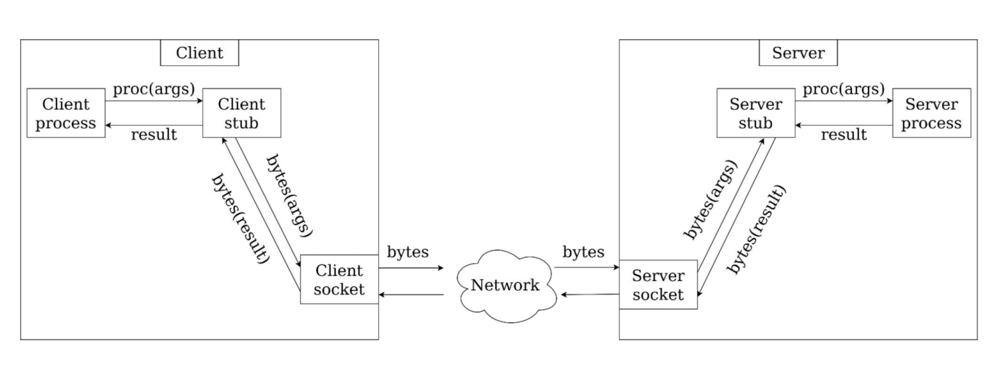

# Remote Procedure Call

## Постановка задачи

Хотим вызвать функцию, реализация которой работает на
другой машине:

```result := RPC.Procedure(args...)```

Хотим спрятать от пользователя:
- Сериализацию параметров
- Сериализацию возвращаемого значения
- Переиспользование канала
- Разбиение потока байт на сообщения (фрейминг)
- Мультиплексирование
- ...

Структура типичного RPC-фреймворка:



## gRPC

Работает в связке с протобуфом. Так же умеет кодгениться под языки.

- Параметр - произвольное Protobuf-сообщение
  - При этом параметр ровно один
- Результат - произвольное Protobuf-сообщение
- Произвольное число процедур у сервиса

```proto
service RPCService {
    rpc ProcessRequest(Request) returns (Response);
}

message Request {
    uint64 id = 1;
    string key = 2;
    repeated string value = 3;
}

message Response {
    oneof response {
        string message = 1;
        uint32 error_code = 2;
    }
}
```

gRPC генерирует код Client Stub и Server Stub.

Под капотом использует TCP.

## gRPC Client Streaming

- Клиент отдает данные по частям
- Между соседними частями проходит произвольное время
- В какой-то момент сервер возвращает ответ и соединение закрывается
- Реализация: TCP + Фрейминг + Маркер конца

```proto
service StreamConsumer {
    rpc ConsumeStream (stream StreamEntity) returns (Response);
}
```

## gRPC Server Streaming

Частовстречаемый паттерн, когда клиент подписывается на какие-нибудь апдейты с сервера вместо того, чтобы спрашивать раз в какое-то время "есть ли апдейты?" (это называется polling).

- Подписываемся на интересующие нас события
- Получаем поток этих событий с сервера только тогда, когда события реально происходят
- Сервер в какой-то момент может закрыть соединение
- Реализация: TCP + Фрейминг + Маркер конца

```proto
service SubscriptionService {
    rpc Subscribe (Subscription) returns (stream Event);
}
```

## gRPC Bidirectional Streaming

Аналогичен WebSocket, если я еще не забыл фронтенд.

```proto
service MessengerService {
    rpc StartMessaging (stream Message) returns (stream Message);
}
```
