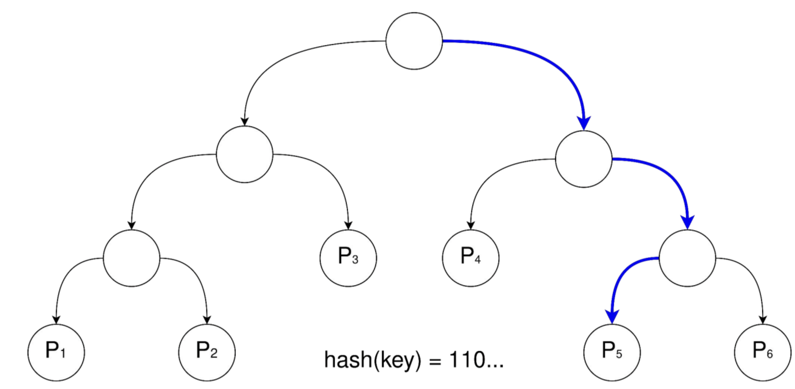
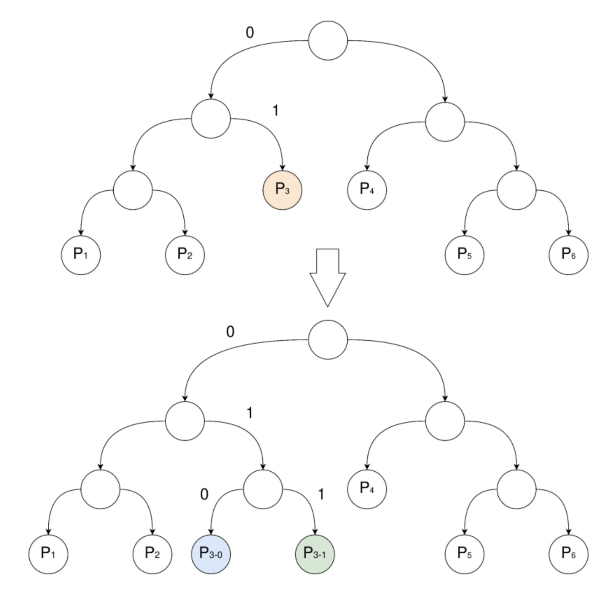
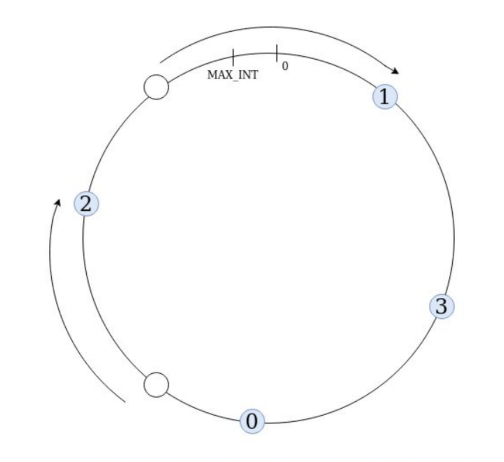

# Шардирование

Мотивация:
- Храним данных больше, чем доступно памяти на одном узле
- Каждый узел обслуживает запросы только к тем данным, которые он хранит (можно распределить нагрузку по частям света, например)
- Не обслуживает запросы к чужим данным
- Позволяем делать больше запросов в секунду (так как например снижаем latency из-за геораспределенности)

## Шардирование по модулю

```node_id := hash(key) % p```

- Шарды заполняются +- равномерно (зависит от хеш-функции)
- При изменении схемы шардирования (добавление/удаление узла) нужно перемещать $O(N)$ ключей

### Как расширяться по-умному

- Можем расширить кластер в два раза
- Для каждого сервера покупаем ещё один
- Переносим половину ключей на новый сервер

Пусть `hash(key) % p = k`, рассмотрим k-ый сервер:
- Если `hash(key) % 2p = k`, оставляем на исходном сервере
- Если `hash(key) % 2p = k + p`, переносим на парный сервер

Бонус: Можно удалить половину кластера обратной операцией.

Бонус 2: Можно расширять в любое натуральное число раз.

По-прежнему нужен перенос $O(N)$ ключей, зато теперь это дело распараллеливается и становится независимым процессом каждого узла.

## Битовый бор

- Берём битовое представление хеша и спускаемся по дереву
- Лист — сервер, хранящий искомый ключ



Высота такого бора логарифм от хеша - это чуть медленнее предыдущего варианта, но примемлемо. Посмотрим какие плюшки эта структура может дать при изменении схемы шардирования.

Кажется, что при изначально хорошем построенном боре количество перемещаемых ключей при решардинге около $O(\frac{N}{2^{\log(M)}})$, где M - количество узлов, или $O(2^{\log{N} - \log{M}})$.

### Добавление сервера

- Расщепляем целевую вершину на две
- Переносим примерно половину ключей на новый сервер (определяем, какой ключ переносить, по i-ому биту хеша)
- Из одного заполненного сервера получаем два заполненных наполовину



Впрочем, никто не гарантирует, что разбиение окажется хорошим.

### Удаление сервера

Случай 1:
- Если у удаляемой вершины есть брат-лист, переносим все ключи на него
- Из двух наполовину заполненных серверов получаем один заполненный целиком

Случай 2:
- Если у удаляемой вершины нет брата-листа, можем заменить только целое родительское поддерево на один лист
- Приходится удалять и другие листья

## Постоянное число секций

- Заводим N секций
- Ключи по секциям распределяем тривиально (хеш по модулю подойдет)
- Секции храним на серверах (централизованно храним информацию о том, какая секция где хранится)

Получился такой хешмап, чтобы узнавать на каком сервере искать ключ. Примечательно, что количество секций не зависит от количества серверов.

Такой индирекшн выглядит дорогим (нужно часто ходить в мастера за таблицей), поэтому хешмап необходимо кэшировать на стороне клиента.

### Добавление сервера

- Переносим часть секций на новый сервер
- Обновляем централизованный хешмап
- Инвалидируем кэши клиентов или ждем, пока они дойдут и заберут новую копию сами

### Удаление сервера

- Переносим секции с удаляемого сервера на оставшиеся
- Обновляем централизованный хешмап
- Инвалидируем кэши клиентов или ждем, пока они дойдут и заберут новую копию сами

### Выбор числа секций

- Нельзя выбрать слишком мало, так как количество серверов не может стать больше количества секций (сервера будут простаивать), значит у нас будет небольшой предел к шардированию.
- Чем больше секций, тем больше возможностей для балансировки
- Располагаем меньше секций на нагруженные сервера, больше - на разгруженные (разделение секций на горячие и холодные)

### Многоуровневое шардирование

Информацию вида `section -> server` тоже можно шардировать (условно добавить +1 уровень индирекшна).

Так можно снять нагрузку с мастера при проведении ремаппинга шардов, так как ответственность за маппинг шардов в серверы уйдет на более глубокий уровень,

## Rendez-vous шардирование

$node_{id} = \argmax_{i=1...P}{hash(concat(key, i))}$

- Равномерное распределение ключей
  - Если хеш-функция "хорошая"
- При добавлении узла каждый существующий узел перемещает только те ключи, которые должны перейти на новый узел
  - $hash(concat(key, new\_id)) > hash(concat(key, cur\_id))$
- При удалении узла перемещаются только те ключи, которые располагались на этом узле
- Поиск узла по ключу за $O(K)$

## Консистентное хеширование

- Каждому узлу соответствует точка на круге
  - `hash(node_name)`
- Проецируем ключ на круг
  - `hash(key)`
- Ищем следующую по часовой стрелке точку, соответствующую узлу



### Добавление узла
- Проецируем новый узел на круг
- Ищем предыдущий и следующий по кругу узлы
- Перемещаем часть ключей со следующего по кругу узла на новый узел
- Ключи перемещаются только на новый узел

### Удаление узла
- Аналогично добавлению
- Ключи перемещаются только с удаляемого узла

### Хранение списка узлов
В дереве поиска:
- $O(\log{K})$ на поиск узла по ключу
- $O(\log{K})$ на добавление/удаление узла

В сортированном массиве:
- $O(\log{K})$ на поиск узла по ключу (неасимптотически быстрее)
- $O(K)$ на добавление/удаление узла

### Неравномерное распределение ключей

- Такое возможно, так как отображения узлов на круг выбираются случайно
- При добавлении нового узла все свои ключи он забирает у единственного существующего узла
- При удалении узла мы перемещаем все его ключи на единственный узел

Используем vnodes!

Каждому физическому узлу соответствует несколько виртуальных:
- `hash(concat(node_name, 0))`
- `hash(concat(node_name, 1))`
- ...

Чем больше - тем равномернее распределение и больше нагрузка на память и тем больше время алгоритма.

## JumpHash

Пусть `ch(key, n)` — индекс узла, хранящего ключ key.
  - $0 \le$ `ch(key, n)` $< n$
  - `ch(key, 1) = 0` для всех ключей

Переход от K серверов к K + 1:
  - Каждый ключ с вероятностью $\frac{1}{K + 1}$ переходит на сервер с индексом K (новый узел)

Сервера не удаляются, только добавляются новые
  - Количество данных в системе только растёт
  - При выходе сервера из строя мы не удаляем его из кластера, а заменяем его другим сервером с тем же индексом и теми же данными

### Доказательство равномерности:

$0 \le \xi_n < n$

Докажем, что $P(\xi_n = i)|_{0 \le i < n} = \frac{1}{n}$

База: $P(\xi_1 = 0) = 1$

Переход: покажем, что

$$P(\xi_n = i)|_{0 \le i < n} = \frac{1}{n} \implies P(\xi_{n+1} = i)|_{0\le i<n+1} = \frac{1}{n + 1}$$

Вероятность, что ключ будет перенесен (???)
- $i = n: P(\xi_{n+1} = n) = \sum_{i=0}^{n-1} P(\xi_n = i)\cdot\frac{1}{n+1} = \sum_{i=1}^{n-1}\frac{1}{n}\cdot\frac{1}{n+1}=\frac{1}{n+1}$

Вероятность, что ключ останется на месте (???)
- $i \ne n: P(\xi_{n+1} = i) = P(\xi_n = i)\cdot(1 - \frac{1}{n+1}) = \frac{1}{n}\cdot\frac{n}{n+1}=\frac{1}{n+1}$

### Наивная реализация

- N раз эмулируем процесс добавления нового сервера
- Подкидываем монетку и смотрим, нужно ли перемещать ключ

```
fun jump_hash(key: Key, n: Int) -> Int:
    random.set_seed(hash(key))
    result = 0
    for i = 1; i < n; i += 1:
        if random.uniform(0, 1) < 1/(i+1):
            result = i
    return result
```

### Оптимизация

- `ch(key, n) = ch(key, n + 1)` в большинстве случаев
- Прыжок происходит когда `ch(key, n + 1) = n + 1` (то есть редко)

(?????)

Поиск точки следующего прыжка:
- Пусть b - точка последнего прыжка
  - `ch(key, b) != ch(key, b + 1)`
  - `ch(key, b + 1) = b`

Найдём точку следующего прыжка:
- Такое максимальное j, что
  - `ch(key, j) = ch(key, b + 1)`

j ≥ i (i ≥ b + 1), если в точке i не произошло

По презентации ничего не понятно, нужно пересмотреть лекцию!!!