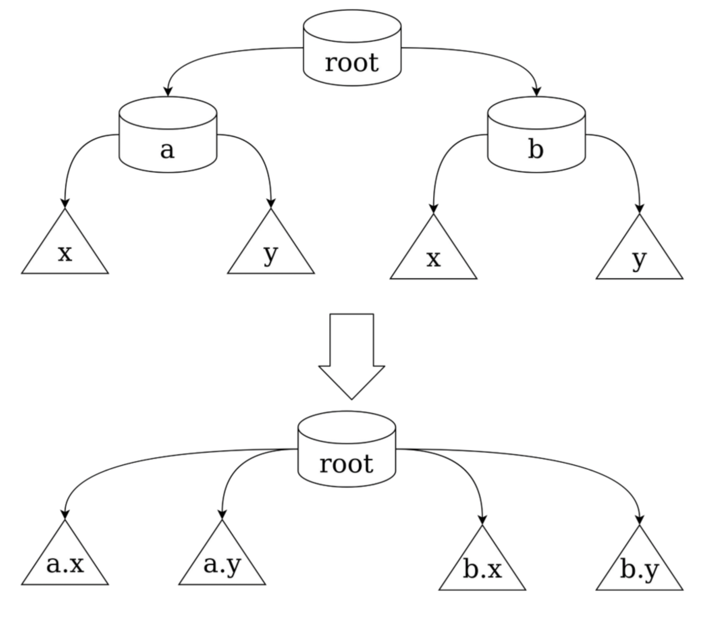
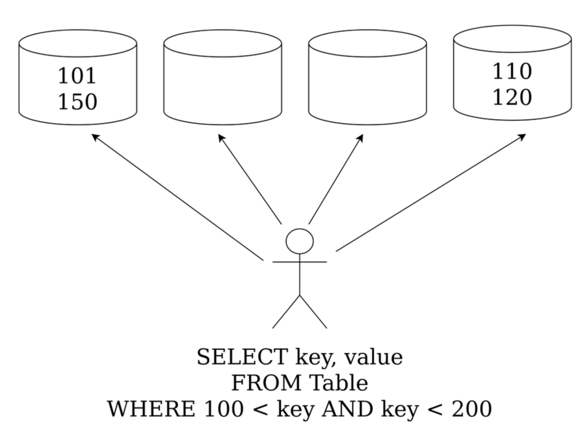

# Шардирование

## Иерархическое шардирование

- Иногда ключи устроены иерархически (каждый ключ имеет вид a.b.c.d)
- Существуют запросы вида “дай мне информацию обо всех млекопитающих”
  - `GET(animals.chordata.mammals.*)`

Если мы шардируем по хешу - нам придётся отправлять этот запрос на каждый шард.

Раз ключи формируют дерево - то и шарды тоже должны формировать дерево. Иерархический запрос будет обслуживаться конкретным поддеревом.

### Сжатие шардов

- Иногда на шарде хранится очень малое число записей
- Сделаем шард, который отвечает не за один уровень иерархии, а сразу за несколько
- Разбиение по уровням может быть произвольным

Пример иерархического шардирования - DNS.

## Упорядоченное шардирование

- Иногда ключи бывают упорядочены
- И мы можем делать по ним запросы, учитывающие порядок ключей

$$\{key, value | key \in [a; b] \}$$

- Храним ключи в упорядоченных блоках
- Для запроса можем сказать, в какие блоки нам нужно сделать запрос (для этого нужно хранить список левых границ с каждого шарда и делать по нему бинпоиск)
- Делаем запрос только к серверам, хранящим нужные блоки

Шардировать такую схему можно и многоуровнево - мастер будет иметь меньше ключей на обработки, но как всегда потенциально повышается latency. Нужно кешировать схемы шардинга.

### Неравномерность записи

Заметим, что новые ключи будут всегда приходить в последний шард - таким образом, упорядоченное шардирование имеет неравномерную загрузку на запись.

### Разделение и слияние блоков

Когда нагрузка на какой-то блок становится слишком большой, можно разделить его на две половины.

Когда нагрузка становится слишком маленькой, можно выполнять слияние блоков.

### Добавление и удаление серверов

При добавлении сервера, переноси в него нужные блоки и делаем ремап у серверов, отвечающих за маппинг отрезков в блоки/сервера.

При удалении, аналогично.

### Изменение границ блоков и коллокация

Можно менять границы блоков в зависимости от статистики запросов:
- Из двух серверов выделить общий горячий подотрезок, изменив границы блоков,  и горячий переместив на один сервер, так мы уменьшаем количество серверов на запрос

Можно менять размещение блоков:
- Несколько горячих блоков можно класть на один hot-сервер (это называется коллокацией), так мы уменьшаем количество серверов на запрос

## Геошардирование

Располагаем данные близко к пользователю, который будет их запрашивать:
- Так мы уменьшим latency
- И прогнемся под правила местного регулятора (геошардирование может быть затребовано по законодательным причинам)

Пользователь может переехать в другой регион.
- Его данные должны переехать вслед за ним, чтобы задержка продолжала оставаться низкой

При добавлении новых шардов/изменении границ регионов также нужно перемещать часть данных.

# Задача полнотекстового поиска, обратный индекс

Хотим по списку слов найти документы, в которых эти слова встречаются

## Булев поиск

Чтобы расширить возможности поиска, можем воспользоваться булевым поиском - это дерево, каждый лист которого содержит слово (запрос), а остальные вершины содержат булевы операторы (and, or).

Мы можем задать наш поисковый запрос булевым выражением и тривиально его посчитать (объединение, пересечение множеств).

Пример: `(кошка & собака) | свинья | жаба`.

### Шардирование по словам

Пусть мы на каждом узле храним подмножество слов и целиком ассоциированный с ним список документов.
- Тогда иногда мы не сможем запрос вида `кошка & собака` локально (посчитать целиком на каком-то хосте)

### Шардирование по документам

Пусть мы на каждом узле храним полный словарь слов, и каждый узел отвечает только за подмножество документов.
- При этом если слово не содержится ни в одном из документов шарда, удалим его из словаря
- Тогда запрос всегда может быть исполнен локально на каждом узле
- Для исполнения запроса нужно пойти на все шарды, в отличие от шардирования по словам

## Решардинг

Надо делать грамотно - нельзя допускать несогласованности данных.

- Когда данные не перезаписывают, их можно спокойно переносить
- Если происходит запись в старого хозяина во время решардинга:
  - По еще неперенесенному ключу, просто обновляем у себя значение
  - Иначе мы обязаны передать изменение новому хозяину (репликация изменений)
- На читающие запросы отвечает старый владелец, его данные актуальны

Может случиться так, что перенос ключей никогда не закончится, если клиенты будут постоянно добавлять новые ключи:
- Значит, в какой-то момент старый владелец должен перестать принимать запросы на изменение, завершить перенос и передать владение
- Теперь на все запросы будет отвечать новый владелец
- При этом старый владелец может отвечать на читающие запросы даже после того, как прекратили отвечать на пишущие, но только до посылке сообщения о передаче ответственности

Недостатки репликации изменений:
- Если есть активный поток изменений, один и тот же ключ будем перемещать много раз
  - Помним, какие ключи мы уже передали новому владельцу
  - Отказываемся исполнять запросы по таким ключам
  - Запросы по ним исполняет новый владелец

Ключи "в полете":
- По некоторым ключам никто не может выполнять запросы: ни старый, ни новый владелец
  - Как только мы послали новому владельцу пачку ключей, мы не можем отвечать на их запросы (вдруг новый вледелец получил данные, но просто не успел послать нам ack?)

Несуществующие ключи:
- Новый владелец во время решардинга не может принимать запросы по тем ключам, которых у него нет, поскольку невозможно отличить несуществующий ключ от того, который еще не перенесен.
